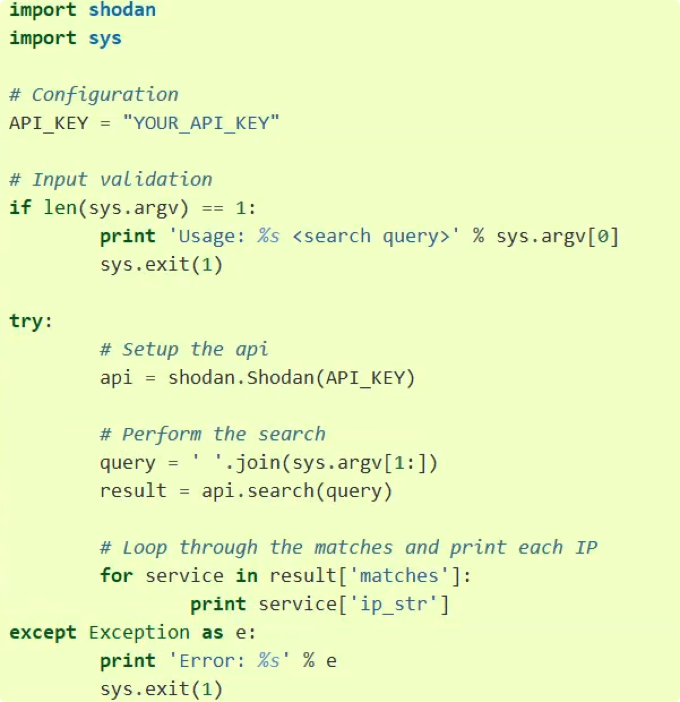

# 被动收集

公开渠道可获得的信息

与目标系统不产生直接交互

尽量避免留下一切痕迹


- 网络拓扑信息

  外网出口

- IP信息

  C段

- 线下网络

  Wi-FiSSID认证信息

- VPN

  厂商登录方式

- 邮件网关

- 手机APP

- 小程序后台

- OA

- SSO

- 边界网络设备

- 上游运营商

## 一、IP地址信息

### 1.1 IP信息


### 1.2 获取真实IP

现在大多数的网站都开启了CDN加速，导致我们获取到的IP地址不一定是真实的IP地址。

#### 什么是CDN

CDN的全称是Content Delivery Network，即内容分发网络。其基本思路是尽可能避开互联网上有可能影响数据传输速度和稳定性的瓶颈和环节，使内容传输的更快、更稳定。通过在网络各处放置节点服务器所构成的在现有的互联网基础之上的一层智能虚拟网络，CDN系统能够实时地根据网络流量和各节点的连接、负载状况以及到用户的距离和响应时间等综合信息将用户的请求重新导向离用户最近的服务节点上。其目的是使用户可就近取得所需内容，解决 Internet网络拥挤的状况，提高用户访问网站的响应速度。

#### 方法

- 多地Ping法：由CDN的原理，不同的地方去Ping服务器，如果IP不一样，则目标网站肯定使用了CDN。
  - https://asm.ca.com/en/ping.php
  - http://ping.chinaz.com/

- 二级域名法：使用了CDN的域名的父域或者子域名不一定使用了CDN，可以通过这种方式去查找对应的IP。

  目标站点一般不会把所有的二级域名放cdn上。通过在线工具如站长帮手，收集子域名，确定了没使用CDN的二级域名后。本地将目标域名绑定到同IP（修改host文件），如果能访问就说明目标站与此二级域名在同一个服务器上；如果两者不在同一服务器也可能在同C段，扫描C段所有开80端口的IP，然后挨个尝试。‘

- nslookup法：找国外的比较偏僻的DNS解析服务器进行DNS查询，因为大部分CDN提供商只针对国内市场，而对国外市场几乎是不做CDN，所以有很大的几率会直接解析到真实IP。

- 历史记录查找：CDN可能是在网站上线一段时间后才上线的，可以通过查找域名解析记录的方式去查找真实IP。

- 缓存探测技术

#### 绕过CDN

- 内部邮箱源收集到内部邮箱服务器IP地址
- 网站phpinfo文件phpinfo.php
- 分站IP地址，查询子域名，CDN很贵， 很有可再能分站就不使用CDN。
- 国外访问https://asm.ca.com/en/ping.php
- 查询域名解析记录https://viewdns.info/


## 二、域名信息

### 2.1 whois 信息

#### whois

是用来查询域名的IP以及所有者等信息的传输协议。简单说，whois就是一个用来查询域名是否已经被注册，以及注册域名的详细信息的数据库(如域名所有人、域名注册商)

不同域名后缀的whois信息需要到不同的whois数据库查询。如.com的whois数据库和.edu的就不同。每个域名或IP的WHOIS信息由对应的管理机构保存，例如，以.com结 尾的域名的WHOIS信息由.com域名运营商VeriSign管理，中国国家顶级域名.cn域名由CNNIC(中国互联网络信息中心)管理

WHOIS协议。其基本内容是，先向服务器的TCP端口43建立一个连接，发送查询关键字并加上回车换行，然后接收服务器的查询结果。

通过Whois查询可以获得域名注册者邮箱地址等信息。一般情况下对于中小型网域名注册者就是网站管理

Whois可以查询域名是否被注册，以及注册域名的详细信息的数据库，其中可能会存在一些有用的信息，例如

- 域名所有人
- 域名注册商
- 邮箱
- 域名服务器
- 创建时间
- DNS
- 寻找旁站

#### Whois查询方法

Web接口查询: [whois.aliyun.com/](http://aliyun.com/) 、https: / /www. whois365. com/cn/

http://[whois.chinaz.com/](http://whois.chinaz.com/)、https://whois.aizhan.com/

### 2.2 搜索引擎

搜索引擎通常会记录域名信息，可以通过 `site: domain` (谷歌语法)的语法来查询

### 2.3 子域名

#### 子域名收集的作用

扩大渗透测试范围

找到目标站点突破口

业务边界安全

回归初心“信息收集”

#### 什么是子域名

子域名（或子域;英语：Subdomain）是在域名系统等级中，属于更高一层域的域。比如，[mail.example.com ](http://mail.example.com/) (mail为三级域名)和[calendar.example.com](http://calendar.example.com/)是  [example.com ](http://example.com/) (example为二级域名)的两个子域，而[example.com](http://example.com/)则是顶级域.com的子域。

#### 工具

爆破，搜索引擎收集，dns查询，证书查询

- 子域名挖掘工具如: MaltegoCE、wydomain、subDomainsBrute、 dnsmaper、 Layer子 域名挖掘机
- 搜索引擎挖掘如:在Google中 输入site:sina.com
- 第三方网站查询: [http://tool.chinaz](http://tool.chinaz/). com/subdomain(有访问比例)、https://dnsdumpster.com/
- 证书透明度公开日志枚举: https://rt.sh/ 、http://censys.io/(ip、站点地址)
- 其他途径: https://phpinfo.me/domain(子域名爆破) 、http:///s .[aizhan.com](http://aizhan.com/)(比较综合)

#### 问题

**子域名打开就是404页面、403页面怎么做**

尝试使用谷歌语法查找该站点时候存在可访问的页面，或者查看源代码中是否还存在一些信息泄露之类的，不要一看到403、404就直接忽略。

#### 我国域名情况

我国在国际互联网络信息中心正式注册并运行的顶级域名是.cn，这也是我国的级域名。在顶级域名之下，我国的二级域名又分为类别域名和行政区域名两类。类别域名共6个，包括

- 用于科研机构的.ac;
- 用于工商金融企业的.com;
- 用于教育机构的.edu;用于政府部门的.gov;
- 用于互联网络信息中心和运行中心的.net;
- 用于非盈利组织的.org。
- 而行政区域名有34个，分别对应于我国各省、自治区和直辖市。

### 2.4 域名相关性

同一个企业/个人注册的多个域名通常具有一定的相关性，例如使用了同一个邮箱来注册、使用了同一个备案、同一个负责人来注册等，可以使用这种方式来查找关联的域名。一种操作步骤如下：

- 查询域名注册邮箱
- 通过域名查询备案号
- 通过备案号查询域名
- 反查注册邮箱
- 反查注册人
- 通过注册人查询到的域名在查询邮箱
- 通过上一步邮箱去查询域名
- 查询以上获取出的域名的子域名

## 三、敏感信息

### 3.1 代码信息泄露

#### github信息泄露

Github之邮件配置信息泄露: site:[Github.com](http://github.com/) smtp、site:[Github.com](http://github.com/) smtp:@[qq.com](http://qq.com/)

Github之数据库信息泄露: site:[Github.com](http://github.com/) sa password、site:[Github.com](http://github.com/) root password、site:[Github.com](http://github.com/) User ID=’sa’;Password

Github之svn信息泄露: site:[Github.com](http://github.com/) svn、site:Github .com svn username

Github之综合信息泄露: site:[Github.com](http://github.com/) password、site:[Github.com](http://github.com/) ftp ftppassword、

site:[Github.com](http://github.com/)密码、site:[Github.com](http://github.com/) 内部

## 四、空间测绘

### 3.1 shodan https://www.shodan.io/

- Shodan搜索Webcam(摄像头)

  在搜索框中输入Webcam

* Shodan搜索指定IP地址

  通过关键字host指定具体IP地址。例如: host:61.135. 169.121指定探测IP地址主机信息。

- Shodan搜索指定端口

  通过关键字port指定具体端口号。例如:port:22指定搜索22号端口的主机信息。

- Shodan搜索具体城市

  利用city:城市名指定搜索具体城市的内容。例如: city:hangzhou port:22

- Shodan命令行

  a、安装：easy_install shodan

  b、初始化：初始化Shodan就是给Shodan初始化API Key。API Key在官网上方位置 shodan init APIKey

  c、启动与查找：输入shodan显示操作目录(- help)

  ```shell
  shodan count apache/tomcat(查询服务数量)
  ```

  d、命令行搜索： shodan search microsoft iis 6.0 开放iis6.0的服务器ip与端口

  ```shell
  shodan search tomcat
  ```

  e、Shodan获取指定IP地址信息：shodan host IP(存在的漏洞、开放的端口......)

  f、Shodan获取账号信息：shodan info

  g、Shodan获取自身外部IP地址：shodan myip

  h、Shodan检测是否有蜜罐：shodan honeyscore

- python-shodan使用介绍 具体在**https://developer.shodan.io/api**查看

  

### 3.2 ZoomEye 钟馗之眼 https://www.zoomeye.org/

是一款针对网络空间的搜索引擎，收录了互联网空间中的设备、网站及其使用的服务或组件等信息。

**搜索语法**

1、app:nginx　　组件名

2、ver:1.0　　版本

3、os:windows　　操作系统

4、country:”China”　　国家

5、city:”hangzhou”　　城市

6、port:80　　端口

7、hostname:google　　主机名

8、site:thief.one　　网站域名

9、desc:nmask　　描述

10、keywords:nmask’blog　　关键词

11、service:ftp　　服务类型

12、ip:8.8.8.8　　ip地址

13、cidr:8.8.8.8/24　　ip地址段

## 五、Google Hack

http://www.360doc.com/content/17/0522/17/41741363_656204810.shtml


## 六、重要记录

- CNAME

  CNAME即Canonical name，又称alias，将域名指向另一个域名。其中可能包含其他关联业务的信息。很多网站使用的CDN加速功能利用了该记录。

- MX记录

  MX记录即Mail Exchanger，记录了发送电子邮件时域名对应的服务器地址。可以用来寻找SMTP服务器信息。

- NS记录

  NS (Name Server) 记录是域名服务器的记录，用来指定域名由哪个DNS服务器来进行解析。

- SPF记录

  SPF (Sender Policy Framework) 是为了防止垃圾邮件而提出来的一种DNS记录类型，是一种TXT类型的记录，用于登记某个域名拥有的用来外发邮件的所有IP地址。通过SPF记录可以获取相关的IP信息，常用命令为 `dig example.com txt` 。


\4.   文档图片数据

\5.   公司地址

\6.   公司组织架构

\7.   联系电话/传真号码

\8.   人员姓名/职务

\9.   

\10.  公开的商业信息。


# 主动搜集

直接与目标系统发生通信，无法避免留下访问的痕迹

使用受控的第三方电脑进行探测

扫描：发送不同的探测，根据返回结果判断目标状态。

使用受控的第三方电脑进行探测。

使用代理或已经被控制的主机

做好被封杀的准备

使用噪声迷惑目标，淹没真实的探测流量。

## 一、端口信息

### 1.1、常见端口及其脆弱点

65535个 即: (2^16)

| 端口                                             | 脆弱点                                                       | 利用 |
| ------------------------------------------------ | ------------------------------------------------------------ | ---- |
| **FTP  21/TCP**                                  | 默认用户名密码 `anonymous:anonymous`<br /> 暴力破解密码 <br />VSFTP某版本后门 |      |
| **SSH  22/TCP**                                  | 部分版本SSH存在漏洞可枚举用户名 OpenSSH 7.7前暴力<br />破解密码 |      |
| **Telent  23/TCP**                               | 暴力破解密码<br />嗅探抓取明文密码                           |      |
| **SMTP  25/TCP**                                 | 无认证时可伪造发件人                                         |      |
| **DNS  53/UDP**                                  | 域传送漏洞<br />DNS劫持 <br />DNS缓存投毒 <br />DNS欺骗<br />SPF / DMARC Check   <br />DDoS：DNS Query、FloodDNS 反弹 DNS 隧道 |      |
| **DHCP  67/68**                                  | 劫持/欺骗                                                    |      |
| **POP3  110/TCP**                                | 爆破                                                         |      |
| **RPC  135/TCP**                                 | wmic 服务利用                                                |      |
| **NetBIOS  137/UDP & 138/UDP**                   | 未授权访问 弱口令                                            |      |
| **ZooKeeper  2171/TCP & 2375/TCP**               | 无身份认证                                                   |      |
| **Docker Remote API  2375/TCP**                  | 未限制IP / 未启用TLS身份认证<br /> `http://docker.addr:2375/version` |      |
| **MySQL  3306/TCP**                              | 弱密码 <br />日志写WebShell <br />UDF提权 <br />MOF提权      |      |
| **RDP / Terminal Services  3389/TCP**            | 弱密码                                                       |      |
| **Postgres  5432/TCP**                           | 弱密码<br />执行系统命令                                     |      |
| **VNC  5900/TCP**                                | 弱密码                                                       |      |
| **Redis  6379/TCP**                              | 无密码或弱密码 <br />绝对路径写 WebShell <br />计划任务反弹 Shell <br />写 SSH 公钥  <br />主从复制 RCE<br />Windows 写启动项 |      |
| **JDWP  8000/TCP**                               | 远程命令执行                                                 |      |
| **Kubernetes API Server  6443/TCP && 10250/TCP** | `https://Kubernetes:10250/pods`                              |      |
| **Jenkin  8080/TCP**                             | 未授权访问                                                   |      |
| **Elasticsearch  9200/TCP**                      | 代码执行 `http://es.addr:9200/_plugin/head/` `http://es.addr:9200/_nodes` |      |
| **RabbitMQ  15672/TCP & 15692/TCP & 25672/TCP**  |                                                              |      |
| **MongoDB  27017/TCP**                           | 无密码或弱密码                                               |      |
| **Hadoop  50070/TCP & 50075/TCP**                | 未授权访问                                                   |      |

在Windows命令行中使用netstat -ano显示开放端口。linux中用 [leof](!https://www.runoob.com/w3cnote/linux-check-port-usage.html) 

### 1.2、端口扫描

#### a、全扫描

扫描主机尝试使用三次握手与目标主机的某个端口建立正规的连接，若成功建立连接，则端口处于开放状态，反之处于关闭状态。

全扫描实现简单，且以较低的权限就可以进行该操作。但是在流量日志中会有大量明显的记录。

#### b、半扫描

半扫描也称SYN扫描，在半扫描中，仅发送SYN数据段，如果应答为RST，则端口处于关闭状态，若应答为SYN/ACK，则端口处于监听状态。不过这种方式需要较高的权限，而且现在的大部分防火墙已经开始对这种扫描方式做处理。

#### c、FIN扫描

FIN扫描是向目标发送一个FIN数据包，如果是开放的端口，会返回RST数据包，关闭的端口则不会返回数据包，可以通过这种方式来判断端口是否打开。

这种方式并不在TCP三次握手的状态中，所以不会被记录，相对SYN扫描要更隐蔽一些。masscan

#### 工具使用

nmap

在线探测： http://tool.chinaz.com/port

#### 防御措施

a、关闭不必要的端口;

b、对重要业务的服务端口设置防火墙;

c、加强员工信息安全意识，经常性更换用户密码;

d、经常更新软件，打补丁(patch)

### 1.3 批量搜索

- Censys
- Shodan
- ZoomEye


## 二、站点信息

### 2.1 指纹信息

- 判断网站操作系统以及使用语言
  - Linux大小写敏感，Windows大小写不敏感

- 服务器类型：服务器平台、版本等
- 网站容器：搭建网站的服务组件，例如:iis、Apache、nginx、tomcat等
  - 如 Apache / Nginx / IIS 等
  - 查看header中的信息
  - 根据报错信息判断
  - 根据默认页面判断


- Web容器服务器
  - 如Tomcat / Jboss / Weblogic等

- Web服务

  - Jenkins：未授权访问
  - Gitlab：对应版本CVE

  - Zabbix：权限设置不当

- 后端框架

  - 根据Cookie判断
  - 根据CSS / 图片等资源的hash值判断
  - 根据URL路由判断如wp-admin
  - 根据网页中的关键字判断根据响应头中的X-Powered-By

- WAF信息：WAF识别大多基于Headers头信息，还可以使用Wafw00f，Sqlmap的waf脚本，Nmap的http-waf-detect和http-waf-fingerprint脚本等等。

  - 有WAF，找绕过方式
  - 没有，进入下一步

- Banner信息 欢迎语，在banner信息中可以得到软件开发商，软件名称、版本、服务类型等信息，通过这些信息可以使用某些工具直接去使用相对应的exp去攻击。前提条件：需要和目标建立链接，只有建立了链接，我们才能获取对应的banner信息

  目标服务器上可以对banner进行隐藏或者禁止读取

#### 指纹搜集思路

1.指定路径下指定名称的js文件或代码。

2.指定路径下指定名称的css文件或代码。

3.<title>中的内容，有些程序标题中会带有程序标识，但不是很多。

4.meta标记中带程序标识<meta name="description"/><meta name="keywords"/><meta name="generator"/><meta name="author"/><meta name="copyright"/>

5.display:none中的版权信息。

6.页面底部版权信息，关键字© Powered by等。

7.readme.txt、License.txt、help.txt等文件。

8.指定路径下指定图片文件，如一些小的图标文件，后台登录页面中的图标文件

等，一般管理员不会修改它们。

9.注释掉的html代码中<!–

10.http头的X-Powered-By中的值，有的应用程序框架会在此值输出。

11.cookie中的关键字

12.robots.txt文件中的关键字

robots.txt 中禁止的路径很可能说明站点就有这些路径 而且robots.txt 多是可访问的

13.大小写判断操作系统

14.404页面、302返回时的旗标

#### 工具

CMS识别工具：在线工具 http://whatweb.bugscaner.com/look/ 、云悉指纹、御剑

banner信息：NC（netcat，瑞士军刀）、namp 、Wappalyzer，

CMS (内容管理系统) 信息：

其他Python 脚本工具(供学习) ：Whatweb、httprint、Bugscanner、wappalyzer

#### 利用思路

中间件解析漏洞

查询指定CMS的漏洞：[https://bugs.shuimugan.com](https://bugs.shuimugan.com/)

### 2.2 敏感目录

#### 收集方向

robots.txt、后台目录、安装包、上传目录、mysql管理接口、安装页面

phpinfo、编辑器、iis短文件

#### 常用工具

针对目标Web目录结构和敏感隐藏文件探测是非常重要的。在探测过程中很有可能会探测出后台页面、上传页面、数据库文件、甚至是网站源代码文件压缩包等。

字典爆破 >> 御剑、dirbuster、wwwscan、IlS_shortname_Scanner

蜘蛛爬行 >> 爬行菜刀、webrobot、burp等

dirb命令行工具、

### 2.3 旁站以及c段


# 社会工程学

## 企业信息收集

一些网站如天眼查等，可以提供企业关系挖掘、工商信息、商标专利、企业年报等信息查询，可以提供企业的较为细致的信息。

公司主站中会有业务方向、合作单位等信息。

## 人员信息收集

针对人员的信息收集考虑对目标重要人员、组织架构、社会关系的收集和分析。其中重要人员主要指高管、系统管理员、开发、运维、财务、人事、业务人员的个人电脑。

人员信息收集较容易的入口点是网站，网站中可能包含网站的开发、管理维护等人员的信息。从网站联系功能中和代码的注释信息中都可能得到的所有开发及维护人员的姓名和邮件地址及其他联系方式。

在获取这些信息后，可以在Github/Linkedin等社交、招聘网站中进一步查找这些人在互联网上发布的与目标站点有关的一切信息，分析并发现有用的信息。

此外，可以对获取到的邮箱进行密码爆破的操作，获取对应的密码。

## 钓鱼

基于之前收集到的信息，可以使用Office/CHM/RAR/EXE等文件制作钓鱼邮件发送至目标，进一步收集信息。

其中Office可以使用Office漏洞、宏、OLE对象、PPSX等方式构造利用文件。

Exe可以使用特殊的Unicode控制字符来构建容易混淆的文件名。

如果前期信息收集获取到了运维等人员的邮箱，可以使用运维人员的邮箱发送，如果未收集到相关的信息，可以使用伪造发送源的方式发送邮件。

## 其他信息

公司的公众号、企业号、网站，员工的网盘、百度文库等可能会存在一些敏感信息，如VPN/堡垒机账号、TeamViewer账号、网络设备默认口令、服务器默认口令等。

# 漏洞查询

1目录遍历漏洞 语法为: site:xxx intitle:index.of

2 配置文件泄露 语法为: site:xxx ext:xml | ext:conf | ext:cnf | ext:reg | ext:inf | ext:rdp | ext:cfg | ext:txt | extra | ext:ini

3数据库文件泄露 site:xxx ext:sql | ext:dbf | ext:mdb

4日志文件泄露 site:xxx ext:log

5备份和历史文件 site:xxx ext:bkf | ext:bkp | ext:bak | extld | ext:backup

6SQL错误 site:xxx intext:"sql syntax near" | intext:"syntax error has occurred" | intext:"incorrect syntax near" | intext:"unexpected end of SQL command" | intext:"Warning: mysql_connect()" | intext:"Warning: mysql_query()" | intext:"Warning: pg_connect()"

7公开文件信息 site:xxx ext:doc | ext:docx | extdt | ext:pdf | ext:rtf | ext:sxw | ext:psw | ext:ppt | ext:pptx | ext:pps | ext:csv

8 phpinfo() site:xxx ext:php intitle:phpinfo "published by the PHP Group"
