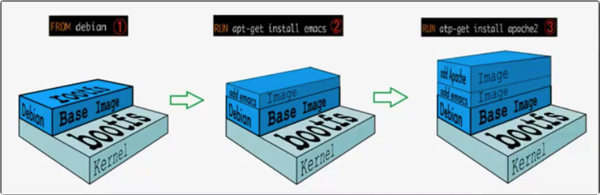
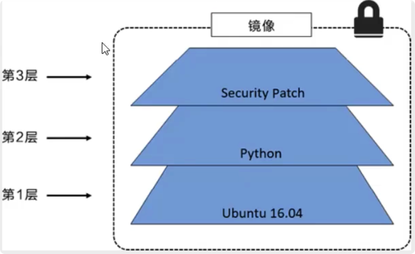
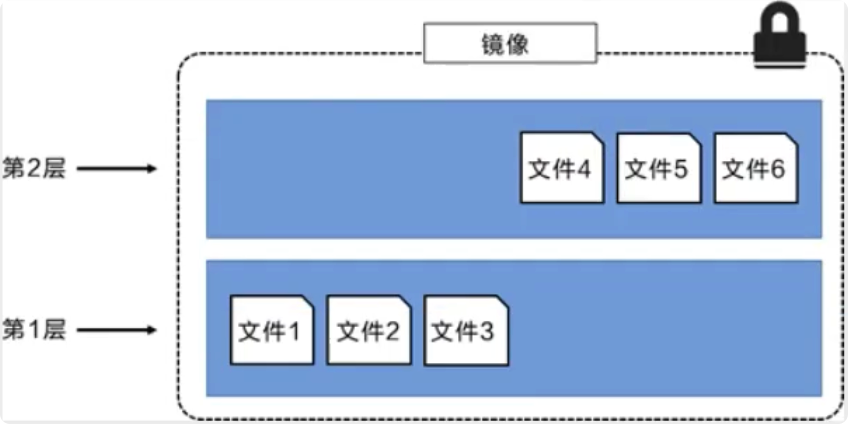
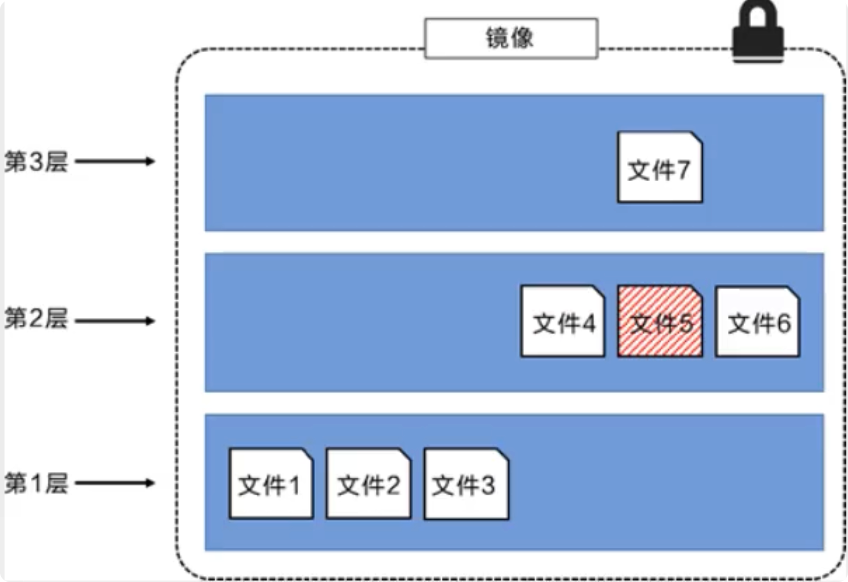
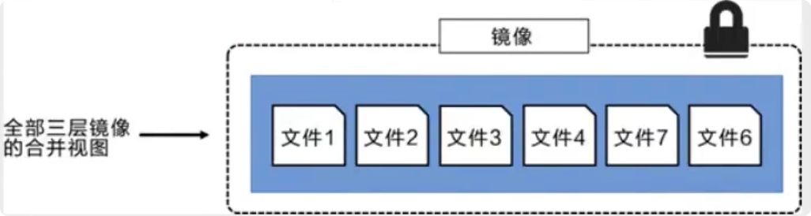
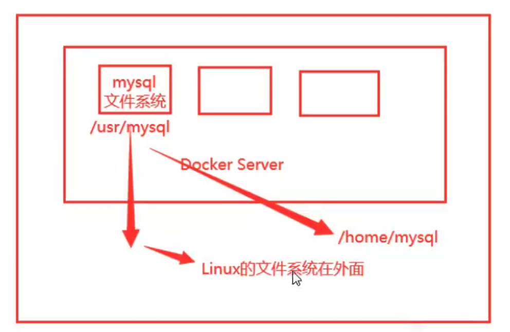
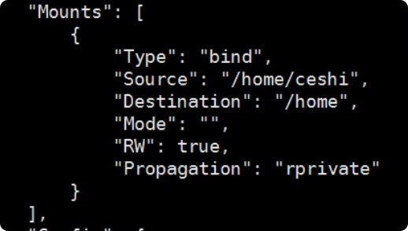
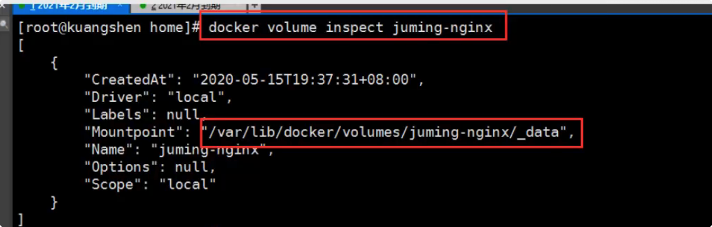
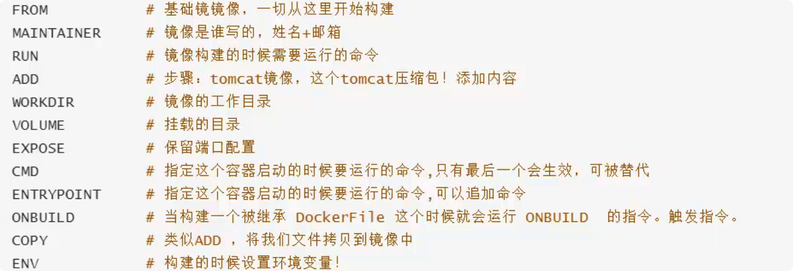
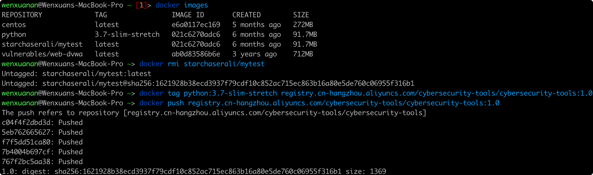

# 一、Docker概述

具体参考：https://docs.docker.com/get-started/


# 二、安装及初步使用

## 1. 安装docker及启动

```shell
$ systemctl start docker.service 
```

  

## 2. 配置阿里云镜像

https://cr.console.aliyun.com/cn-hangzhou/instances/mirrors


## 3. Docker run hello-world的流程


## 4. 底层原理

Docker是一个Client-Server结构的系统，Docker的守护进程运行在主机上，通过Socket从客户端访问。DockerServer执行从Docker-Client接收到的命令。


## 5. Docker为什么比VM快？

- Docker有着比虚拟机更少的抽象层
- Docker 利用的是宿主机(物理机)的内核，VM需要的是Guest OS


# 三、命令使用

## 1. 帮助命令

```shell
$ docker version		# 显示docker的版本信息
$ docker info			# 显示docker的系统信息，包括镜像和容器的数量
$ docker 命令 --help	# 显示命令的帮助信息
```

帮助文档的地址：https://docs.docker.com/engine/reference -> Command-line reference


## 2. 镜像命令

### Get started

```shell
$ docker images		# 查看本地主机上所有的镜像
$ docker images -aq	# 列出所有镜像的id

# 可选项
	-a, --all		# 列出所有镜像
	-q, --quiet		# 只显示镜像的id

$ docker images                                              (base)
REPOSITORY               TAG       IMAGE ID       CREATED        SIZE
docker/getting-started   latest    613921574f76   4 months ago   26.7MB

# 解释
REPOSITORY	镜像的仓库源
TAG			镜像的标签
IMAGE ID	镜像的ID
CREATED		镜像的创建时间
SIZE		镜像的大小

```

### 搜索镜像

```shell
$ docker search mysql                                        (base)
NAME                              DESCRIPTION                                     STARS     OFFICIAL   AUTOMATED
mysql                             MySQL is a widely used, open-source relation…   11593     [OK]
mariadb                           MariaDB Server is a high performing open sou…   4409      [OK]
mysql/mysql-server                Optimized MySQL Server Docker images. Create…   857       [OK]

# 可选项，通过搜索来过滤
	--filter=STARS=3000	# 搜索结果即为STARS > 3000的
```

### 下载镜像

```shell
$ docker pull 镜像名[:tag]	# 下载镜像

~> docker pull mysql	# 不加tag，默认下载 lastest
~ [1]> docker pull --platform linux/x86_64 mysql	# m1 mac 需要加--platform linux/x86_64
Using default tag: latest	# 如果不写tag就是latest
latest: Pulling from library/mysql
b380bbd43752: Pull complete	# 分层下载，docker image的核心 联合文件系统
f23cbf2ecc5d: Pull complete
30cfc6c29c0a: Pull complete
b38609286cbe: Pull complete
8211d9e66cd6: Pull complete
2313f9eeca4a: Pull complete
7eb487d00da0: Pull complete
4d7421c8152e: Pull complete
77f3d8811a28: Pull complete
cce755338cba: Pull complete
69b753046b9f: Pull complete
b2e64b0ab53c: Pull complete
Digest: sha256:6d7d4524463fe6e2b893ffc2b89543c81dec7ef82fb2020a1b27606666464d87
Status: Downloaded newer image for mysql:latest
docker.io/library/mysql:latest	# 真实文件地址

# 等价
$ docker pull mysql
$ docker pull docker.io/library/mysql:latest

# 指定版本下载
$ docker pull mysql:5.7
```

### 删除镜像

```shell
$ docker rmi images

$ # docker rmi -f 镜像id    # 删除指定的id
$ # docker rmi -f 镜像id 镜像id 镜像id    # 删除多个指定的id
$ # docker rmi -f $(docker images -aq) # 删除全部镜像
	$(docker images -aq) 相当于把括号内命令的执行结果当做参数传进去
```


## 3.容器命令

### 新建容器并启动

```shell
$ docker run[可选参数〕image
# 参数说明
--name="Name"	指定容器名字
-d				后台方式运行
-it				使用交互方式运行，进入容器查看内容
-p				端口映射 指定容器的端口 -p 8080:8080
	-p ip:主机端口:容器端口
	-p 主机端口：容器端口（常用）
	-p 容器端口
-p 				随机指定端囗

# 测试，启动并进入容器
$ docker run -it centos /bin/bash

$ ls #查看容器内的centos，基础版本，很多命令都是不完善的！
bin dev etc home 1ib 1ib64 1ost+found media mnt opt proc root run shin srv svs var
tmo usr

# 坑
$ docker run -d centos
	# 问题docker ps，发现 centos 停止了
	# 常见的坑：docker 容器使用后台运行，就必须要有要一个前台进程，docker run -it centos /bin/bash 就是前台进程，可以使用docker ps查看一下有没有这个服务
	# docker发现没有应用，就会自动停止nginx，容器启动后，发现自己没有提供服务，就会立刻停止，就是没有程序了
	
# 用完即删，测试
$ docker run -i -rm container

# 查看 run 时的辅助命令
$ docker run --help
```

### 列出所有容器

```shell
$ docker ps # 列出当前正在运行的容器
-a		# 列出当前正在运行的容器+带出历史运行过的容器
-n=?	# 显示最近创建的容器
-q 		# 只显示容器的编号
```

### 启动和停止容器

```shell
$ docker start 容器id		# 启动容器
$ docker restart 容器id	# 重启容器
$ docker stop 容器id		# 停止当前正在运行的容器
$ docker ki1l 容器id		# 强制停止当前容器
```

### 进入正在运行的容

```shell
$ docker exec -it container bashshell(bin/bash)	# 进入容器后开启一个新的终端，可以在里面操作（常用）
$ docker attach	container	# 进入容器正在执行的終端，不会启动新的进程！
	# Docker attach可以attach到一个已经运行的容器的stdin(标准输入，一般指键盘输入到缓冲区里的东西)，然后进行命令执行的动作。
	# 但是需要注意的是，如果从这个stdin中exit，会导致容器的停止。
```


## 4.容器与宿主机交互

### 拷贝文件

```shell
$ docker cp container:/home/test.java /home	# 从容器拷贝到宿主机
```


## 5.日志与信息

```shell
$ docker logs --help
```

### 查看容器中进程信息

```shell
$ docker top container
```

### 查看镜像的元数据

```shell
$ docker inspect container
```


# 四、镜像 联合文件系统

### 1. UnionFs （ 联合文件系统）

UnionFS（联合文件系统）：Union文件系统(UnionFS）是一种分层、轻量级并且高性能的文件系统，它支持对文件系统的修改作为一次提交来一层层的叠加，同时可以将不同目录挂载到同一个虚拟文件系统下(unite several directories into a single virtual filesystem)。 Union 文件系统是 Docker 镜像的基础。镜像可以通过分层来进行继承，基于基础镜像（没有父镜像），可以制作各种具体的应用镜像。

特性：一次同时加载多个文件系统，但从外面看起来，只能看到一个文件系统，联合加载会把各层文件系统叠加起来，这样最终的文件系统会包含所有底层的文件和目录

### 2. 镜像加载原理

docker的镜像实际上由一层一层的文件系统组成。  

bootfs(boot file system)主要包含 bootloader 和 kernel,bootloader 主要是引导加载 kernel, Linux 刚启动时会加载 bootfs 文件系统，在Docker镜像的最底层是 bootfs。这一层与我们典型的Linux/Unix系统是一样的，包含 boot 加载器和内核。当 boot 加载完成之后整个内核就都在内存中了，此时内存的使用权已由 bootfs 转交给内核，此时系统也会卸载 bootfs。

rootfs (root file system），在 bootfs 之上。包含的就是典型 Linux 系统中的 /dev,/proc,/bin,letc  等标准目录和文件。rootfs就是各种不同的操作系统发行版，比如Ubuntu， Centos等等。



对于一个精简的OS，rootfs 可以很小，只需要包含最基本的命令，工具和程序库就可以了，因为底层直接用Host的kernel，自己只需要提供rootfs就可以了。由此可见对于不同的linux发行版，bootfs基本是一致的，rootfs会有差别，因此不同的发行版可以公用bootfs

### 3. 分层理解

下载一个镜像，注意观察下载的日志输出，可以看到是一层一层的在下载

资源共享：比如有多个镜像都从相同的Base镜像构建而来，那么宿主机只需在磁盘上保留一份base镜像，同时内存中也只需要加载一份base镜像，这样就可以为所有的容器服务了，而且镜像的每一层都可以被共享。

查看镜像分层的方式可以通过 docker image inspect 命令


所有的 Docker 镜像都起始于一个基础镜像层 ，当进行修改或增加新的内容时，就会在当前镜像层之上，创建新的镜像层。举一个简单的例子，假如基于 Ubuntu Linux 16.04 创建一个新的镜像，这就是新镜像的第一层；如果在该镜像中添加 Python包，就会在基础镜像层之上创建第二个镜像层；如果继续添加一个安全补丁 ，就会创建第三个镜像层。

该镜像当前已经包含 3 个镜像层，如下图所示（这只是一个用于演示的很简单的例子）。



在添加额外的镜像层的同时 ，镜像始终保持是当前所有镜像的组合 ，理解这一点非常重要。下图中举了一个简单的例子，每个镜像
层包含 了个文件，而镜像包含了来自两个镜像层的6个文件



上图中的镜像层跟之前图中的略有区别 ，主要目的是便于展示文件。

下图中展示了一个稍微复杂的三层镜像，在外部看来整个镜像只有 6 个文件，这是因为最上层中的文件7是文件5的一个更新版
本



这种情况下，上层镜像层中的文件覆盖了底层镜像层中的文件。这样就使得文件的更新版本作为一个新镜像层添加到镜像当中。

Docker 通过存储引擎（新版本采用快照机制）的方式来实现镜像层堆栈，并保证多镜像层对外展示为统一的文件系统。

Linux 上可用的存储引1擎有 AUFS、Overlay2、Device Mapper、Btrfs 以及 ZFS。顾名思义，每种存储引擎都基于 Linux 中对应的文件系统或者块设备技术，并且每种存储引l擎都有其独有的性能特点。

Docker 在Windows 上仅支持 windowsfilter一种存储引擎，该引擎基于 NTFS 文件系统之上实现了分层和 CoW[1]。

下图展示了与系统显示相同的三层镜像。所有镜像层堆叠并合并，对外提供统一的视图。



### 4. 特点

Docker镜像都是只读的，当容器启动时，一个新的可写层被加载到镜像的顶部！

这一层就是我们通常说的容器层，容器之下的都叫镜像层！


### 5. commit 镜像

```shell
$ docker commit		# 提交容器成为一个新的副本

# 命令和git原理类似
docker commit -m="提交的描述信息” -a="作者" 容器id [TAG]
```


# 五、容器数据卷

### 1. 需求：数据可以持久化，容器可以数据共享，同步到本地

通过目录的挂载解决



```shell
docker run -it -v 主机目录：容器内目录
#测试
$ docker run -it -v /home/ceshi: /home centos /bin/bash	# 启动起来时候我们可以通过docker inspect 容器id
```



### 2. 挂载 tips

容器与物理主机会占用两倍内存。

容器删除，主机储存的数据不会删除

如果 docker inspect后没有显示挂载，就说明挂载失败


### 3. 具名挂载与匿名挂载

```shell
# 匿名挂载: -v 只写了容器内路径，没有写容器外路径
-v 容器内路径
$ docker run -d -P --name nginx01 -v /etc/nginx nginx # 此处的 --name 是指定容器名字

# 查看所有 volume 的情况
$ docker volume ls
local         xxxxxxxxxxxx


# 具名挂载
$ docker run -d -P --name nginx02 -v juming-nginx:/etc/nginx nginx

$ docker volume ls
DEIVER    VOLUME NAME
local     juming-nginx

# 查看是具名挂载还是匿名挂载，还是指定路径挂载
-v 容器内路径		# 匿名挂载
-v 卷名:容器内路径		# 具名挂载
-v /宿主机路径:/容器内路径	# 指定路径挂载

# 扩展
# 通过 -v 容器内路径: ro rw 改变读写权限
ro readonly	# 只读
rw readwrite	# 可读可写
```

查看挂载结果



所有的docker容器内的卷，没有指定目录的情况下都是在 /var/lib/docker/volumes/xxxx/_data

### 4. 共享卷

```shell
# 共享卷
$ docker run -it --name centos01 -v 宿主机文件夹路径:docker容器文件夹路径 centos


$ docker run -it --name centos02 --volumes-from centos01 centos
```

只有挂载卷之后才可以进行共享，原来自己的文件夹是不行的

备份拷贝机制

### 5. 容器数据卷

容器之间配置信息的传递，数据卷容器的生命周期一直持续到没有容器使用为止。但是一旦持久化到了本地，删除容器，本地的数据是不会删除的。


# 六、DockerFile

### 1. 基础

保留关键字必须是大写

每一个指令都会提交一个新的镜像层并提交



### 2. 指令

#### FROM		基础构建镜像

```dockerfile
格式：
　　FROM <image>
　　FROM <image>:<tag>
　　FROM <image>@<digest>
示例：
　　FROM mysql:5.6
注：
　　tag或digest是可选的，如果不使用这两个值时，会使用latest版本的基础镜像
```

#### MAINTAINER		维护者信息

```dockerfile
格式：
    MAINTAINER <name>
示例：
    MAINTAINER Jack
    MAINTAINER jack@163.com
    MAINTAINER Jack <jack@163.com>
```

#### RUN		**构建镜像时执行的命令，一个文件中可以包含多个RUN命令**

```dockerfile
RUN用于在镜像容器中执行命令，有以下两种命令执行方式：
shell执行，即/bin/sh 
格式：
    RUN <command>

exec执行
格式：
    RUN ["executable", "param1", "param2"]
    要注意的是，executable是命令，后面的param是参数 
示例： RUN yum install -y nginx 
      RUN ["yum", "install", "-y", "nginx"] 
注：
　　RUN指令创建的中间镜像会被缓存，并会在下次构建中使用。如果不想使用这些缓存镜像，可以在构建时指定--no-cache参数，如：docker build --no-cache
```

每条 RUN 指令将在当前镜像基础上执行指定命令，并提交为新的镜像层(见四章三节分层理解) ，所以,RUN命令能合并则合并，尽量减少镜像层。

#### ADD		**将本地文件添加到容器中，tar类型文件会自动解压(网络压缩资源不会被解压)，可以访问网络资源，类似wget**

```dockerfile
格式：
    ADD <src>... <dest>
    ADD ["<src>",... "<dest>"] 用于支持包含空格的路径
示例：
    ADD hom* /mydir/          # 添加所有以"hom"开头的文件
    ADD hom?.txt /mydir/      # ? 替代一个单字符,例如："home.txt"
    ADD test relativeDir/     # 添加 "test" 到 `WORKDIR`/relativeDir/
    ADD test /absoluteDir/    # 添加 "test" 到 /absoluteDir/
  注意：

      需要复制的本地文件一定要放在Dockerfile文件的同级目录下
  原因：

      因为构建环境将会先上传到Docker守护进程，而复制是在Docker守护进程中进行的。任何位于构建环境之外的东西都是不可用的。ADD指令的目的的位置则必须是容器内部的一个绝对路径。
```

#### WORKDIR		**指定工作目录，类似于cd命令，之后的命令都是基于此工作目录**

```dockerfile
格式：
    WORKDIR /path/to/workdir
示例：
    WORKDIR /a  (这时工作目录为/a)
    WORKDIR b  (这时工作目录为/a/b)
    WORKDIR c  (这时工作目录为/a/b/c)
注：
　　通过WORKDIR设置工作目录后，Dockerfile中其后的命令RUN、CMD、ENTRYPOINT、ADD、COPY等命令都会在该目录下执行。在使用docker run运行容器时，可以通过-w参数覆盖构建时所设置的工作目录。
```

#### VOLUME		**添加卷，用于指定持久化目录**

```dockerfile
格式：
    VOLUME ["/path/to/dir"]
示例：
    VOLUME ["/data"]
    VOLUME ["/var/www", "/var/log/apache2", "/etc/apache2"]
# 后续可以通过 --volumes-from 参数来共享卷
注：
　　一个卷可以存在于一个或多个容器的指定目录，该目录可以绕过联合文件系统，并具有以下功能：
1 卷可以容器间共享和重用
2 容器并不一定要和其它容器共享卷
3 修改卷后会立即生效
4 对卷的修改不会对镜像产生影响
5 卷会一直存在，直到没有任何容器在使用它
```

通过 VOLUME 指令创建的挂载点，无法指定主机上对应的目录，是自动生成的。

#### EXPOSE		**指定暴露镜像的端口供主机做映射**

```dockerfile
格式：
    EXPOSE <port> [<port>...]
示例：
    EXPOSE 80 443
    EXPOSE 8080
    EXPOSE 11211/tcp 11211/udp
注：
　　EXPOSE并不会让容器的端口访问到主机。要使其可访问，需要在docker run运行容器时通过-p来发布这些端口，或通过-P参数来发布EXPOSE导出的所有端口
```

#### CMD		**构建容器后调用，也就是在容器启动时才进行调用，存在多个CMD时只有最后一个生效，也支持exec语法。**

```dockerfile
格式：
    CMD ["executable","param1","param2"] (执行可执行文件，优先)
    CMD ["param1","param2"] (设置了ENTRYPOINT，则直接调用ENTRYPOINT添加参数)
    CMD command param1 param2 (执行shell内部命令)
示例：
    CMD echo "This is a test." | wc -
    CMD ["/usr/bin/wc","--help"]
注：
 　　CMD不同于RUN，CMD用于指定在容器启动时所要执行的命令，而RUN用于指定镜像构建时所要执行的命令。
```

#### ENTRYPOINT		**配置容器，使其可执行化。配合CMD可省去"application"，只使用参数。**

```dockerfile
格式：
    ENTRYPOINT ["executable", "param1", "param2"] (可执行文件, 优先)
    ENTRYPOINT command param1 param2 (shell内部命令)
示例：
    FROM ubuntu
    ENTRYPOINT ["top", "-b"]
    CMD ["-c"]
    
    ENTRYPOINT ["/docker-entrypoint.sh"] # 使用脚本
注：
　　　ENTRYPOINT与CMD非常类似，不同的是通过docker run执行的命令不会覆盖ENTRYPOINT，而docker run命令中指定的任何参数，都会被当做参数再次传递给ENTRYPOINT。Dockerfile中只允许有一个ENTRYPOINT命令，多指定时会覆盖前面的设置，而只执行最后的ENTRYPOINT指令。
```

#### ONBUILD		**用于设置镜像触发器**

```Dockerfiles
格式：
　　ONBUILD [INSTRUCTION]
示例：
　　ONBUILD ADD . /app/src
　　ONBUILD RUN /usr/local/bin/python-build --dir /app/src
注：
　　当所构建的镜像被用做其它镜像的基础镜像时（比如用户的镜像需要从某为准备好的位置添加源代码，或者用户需要执行特定于构建镜像的环境的构建脚本），该镜像中的触发器将会被钥触发
 

例如创建镜像image-A
  FROM ubuntu
  ...
  ONBUILD ADD . /var/www
  ...

然后创建镜像image-B，指定image-A为基础镜像，如
  FROM image-A
  ...

 

然后在构建image-B的时候，日志上显示如下:
  Step 0 : FROM image-A
  # Execting 1 build triggers
  Step onbuild-0 : ADD . /var/www
  ...
```

#### COPY		**功能类似ADD，但是是不会自动解压文件，也不能访问网络资源**

​    就是不能解压，其他限制条件跟ADD一样

#### ENV		**设置环境变量**

```dockerfile
格式：
    ENV <key> <value>  #<key>之后的所有内容均会被视为其<value>的组成部分，因此，一次只能设置一个变量
    ENV <key>=<value> ...  #可以设置多个变量，每个变量为一个"<key>=<value>"的键值对，如果<key>中包含空格，可以使用\来进行转义，也可以通过""来进行标示；另外，反斜线也可以用于续行
示例：
    ENV myName John Doe
    ENV myDog Rex The Dog
    ENV myCat=fluffy
```

#### **USER		指定运行容器时的用户名或 UID，后续的操作都会使用指定用户。使用USER指定用户时，可以使用用户名、UID或GID，或是两者的组合。当服务不需要管理员权限时，可以通过该命令指定运行用户。并且可以在之前创建所需要的用户**

```dockerfile
格式:
　　USER user
　　USER user:group
　　USER uid
　　USER uid:gid
　　USER user:gid
　　USER uid:group

 示例：
　　USER www

 注：
　　使用USER指定用户后，Dockerfile中其后的命令RUN、CMD、ENTRYPOINT都将使用该用户。镜像构建完成后，通过docker run运行容器时，可以通过-u参数来覆盖所指定的用户。
```

### 3. docker build

docker build 命令用于使用 Dockerfile 创建镜像

```shell
$ docker build build [OPTIONS] PATH | URL |-

参数说明：
--build-arg=[] :设置镜像创建时的变量；

--cpu-shares :设置 cpu 使用权重；

--cpu-period :限制 CPU CFS周期；

--cpu-quota :限制 CPU CFS配额；

--cpuset-cpus :指定使用的CPU id；

--cpuset-mems :指定使用的内存 id；

--disable-content-trust :忽略校验，默认开启；

-f :指定要使用的Dockerfile路径；

--force-rm :设置镜像过程中删除中间容器；

--isolation :使用容器隔离技术；

--label=[] :设置镜像使用的元数据；

-m :设置内存最大值；

--memory-swap :设置Swap的最大值为内存+swap，"-1"表示不限swap；

--no-cache :创建镜像的过程不使用缓存；

--pull :尝试去更新镜像的新版本；

--quiet, -q :安静模式，成功后只输出镜像 ID；

--rm :设置镜像成功后删除中间容器；

--shm-size :设置/dev/shm的大小，默认值是64M；

--ulimit :Ulimit配置。

--tag, -t: 镜像的名字及标签，通常 name:tag 或者 name 格式；可以在一次构建中为一个镜像设置多个标签。

--network: 默认 default。在构建期间设置RUN指令的网络模式
```

实战例子

```shell
# 使用当前目录的 Dockerfile 创建镜像，标签为 runoob/ubuntu:v1。
docker build -t runoob/ubuntu:v1 . 

# 使用URL github.com/creack/docker-firefox 的 Dockerfile 创建镜像。
docker build github.com/creack/docker-firefox

# 也可以通过 -f Dockerfile 文件的位置：
$ docker build -f /path/to/a/Dockerfile .

# 在 Docker 守护进程执行 Dockerfile 中的指令前，首先会对 Dockerfile 进行语法检查，有语法错误时会返回：
$ docker build -t test/myapp .
Sending build context to Docker daemon 2.048 kB
Error response from daemon: Unknown instruction: RUNCMD
```

### 4. 区别

- **CMD 和 ENTRYPOINT的区别**

任何使用docker run <image> 命令传入的参数都会附加在entrypoint指令之后，但用此命令传入的参数会覆盖在Dockerfile中使用CMD指令设定的值。

# 七、镜像发布

**发布镜像到docker hub**

```shell
# 首先登录
$ docker login -u -p 

$ docker push
```



发布镜像时，先打tag，如果使用docker账户登录，则需使用 docker官网的用户名/image name

如果使用阿里的镜像仓库，则需使用

```shell 
registry.cn-hangzhou.aliyuncs.com/cybersecurity-tools/cybersecurity-tools:[镜像版本号]
```

或者可以使用

```shell
# 打成压缩包
$ docker save
$ docker load
```

