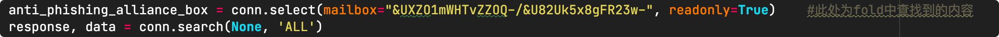
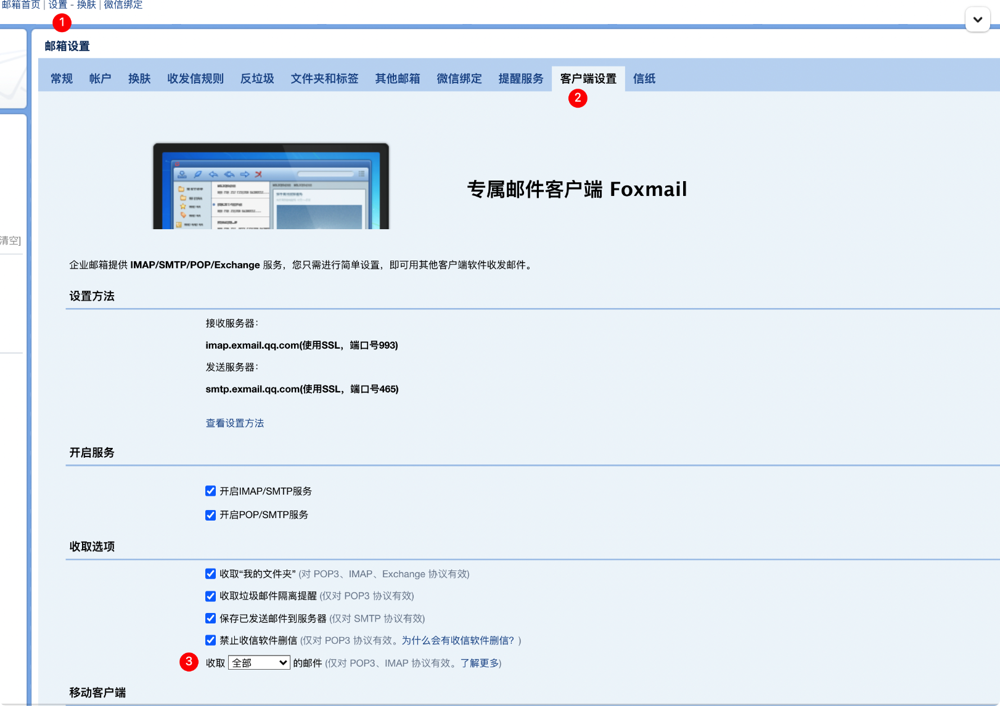

# A

# B

# C

# D

# E

## email about

### use

https://www.cnblogs.com/Wu13241454771/p/13573601.html

### 一些坑

- 无法出现全部邮件




imap4.search()命令 第二个参数有规则

在查询时，如果只出现特定数量的邮件信息，看看收取选项那是不是有问题



# F


# Module set

packet：http://jobbole.github.io/awesome-python-cn/#_46

awesome：https://github.com/vinta/awesome-python

# S

## sys


#### sys模块是与python解释器交互的一个接口。

sys 模块提供了许多函数和变量来处理 Python 运行时环境的不同部分。

在解释器启动后, argv 列表包含了传递给脚本的所有参数, 列表的第一个元素为脚本自身的名称。

```
sys.argv[0] 表示程序自身
sys.argv[1] 表示程序的第一个参数
sys.argv[2] 表示程序的第二个参数
```

#### sys.exit(n) 退出程序，正常退出时exit(0)

#### sys.version 获取Python解释程序的版本信息

```python
print(sys.version)
```

#### sys.platform 返回操作系统平台名称

#### sys.stdin.readline()与input

```python
import sys
# sys.stdin.readline() 相当于input，区别在于input不会读入'\n'
aa = sys.stdin.readline()
bb = input('请输入：')
 
print(len(aa))
print(len(bb))
 
#结果
i love DL
请输入：i love DL
10
9
```

①sys.stdin.readline()方式与input方式的区别是：len(aa)元素中多了一个‘\n’换行符。即sys.stdin.readline()方式会读入换行符。

②还有一个区别在于，input()里面可以直接传入文本，然后打印出来。