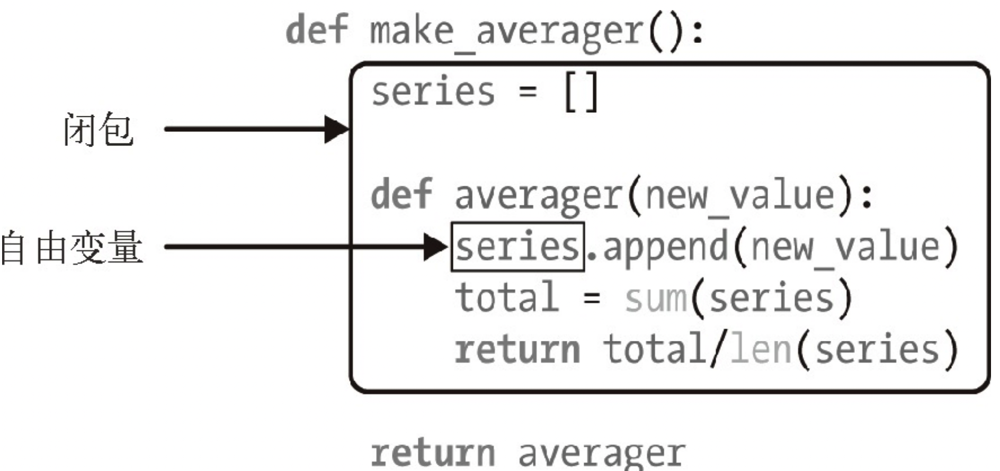

# 闭包

> 闭包是一种函数，它会保留定义函数时存在的自由变量的绑定，这样调用函数时，虽然定义作用域不可用了，但是仍能使用那些绑定。

## 一、自由变量


自由变量：指未在本地作用域中绑定的变量

## 二、nonlocal

它的作用是把变量标记为自由变量，即使在函数中为变量赋予新值了，也会变成自由变量。
如果为 nonlocal 声明的变量赋予新值，闭包中保存的绑定会更新。

```python
def make_averager():
    count = 0
    total = 0
    def averager(new_value):
        nonlocal count, total
        count += 1
        total += new_value
        return total / count
    return averager
```




调用外层函数时， 运行到的内层def语句仅仅是完成对内层函数的定义，而不会去调用内层函数，除非在嵌套函数之后 又显式的对其进行调用。

本地作用域在函数结束后就立即失效，而嵌套作用域在嵌套的函数返回后却仍然有效。

# 装饰器

## 一、装饰器特性

能把被装饰的函数替换成其他函数

```python
@decorator
def fun():
    pass
# 等效于
fun = decorator(fun)
```

装饰器在加载模块时立即执行

缺点：遮盖了被装饰函数的 \_\_name\_\_ 和 \_\_doc\_\_ 属性

## 使用

详解：https://blog.csdn.net/chk_plusplus/article/details/120821037

```python
def clock(func):
    def clocked(*args):
        t0 = time.perf_counter() # perf_counter()返回当前的计算机系统时间
        result = func(*args)
        elapsed = time.perf_counter() - t0
        name = func.__name__
        arg_str = ', '.join(repr(arg) for arg in args)
        print('[%0.8fs] %s(%s) -> %r' % (elapsed, name, arg_str, result))
        return result
    return clocked
```


## X、@functools.wraps


import functools.wraps

在内函数上添加装饰器 @functools.wraps(func)


## X、functools.lru_cache()

```
1.functools.lru_cache 实现了备忘（memoization）功能。
这是一项优化技术，它把耗时的函数的结果保存起来，避免传入相同的参数时重复计算。
即 下次以相同参数调用时直接返回上一次的结果
LRU 三个字母是“LeastRecently Used”的缩写，表明缓存不会无限制增长，一段时间不用的缓存条目会被扔掉。

2.必须像常规函数那样调用 lru_cache ：@functools.lru_cache()。这样lru_cache 可以接受配置参数
functools.lru_cache(maxsize=128, typed=False) 
    maxsize 参数指定存储多少个调用的结果。缓存满了之后，旧的结果会被扔掉，腾出空间。为了得到最佳性能，maxsize 应该设为 2 的幂。
    typed 参数如果设为 True，把不同参数类型得到的结果分开保存，即把通常认为相等的浮点数和整数参数（如 1 和 1.0）区分开
    
3.lru_cache 使用字典存储结果，而且键根据调用时传入的定位参数和关键字参数创建，所以被 lru_cache 装饰的函数，它的所有参数都必须是可散列的。

4.装饰器是函数，因此可以组合起来使用，即可以在已经被装饰的函数上应用装饰器

叠放装饰器
把 @d1 和 @d2 两个装饰器按顺序应用到 f 函数上，作用相当于 f =d1(d2(f))。
```