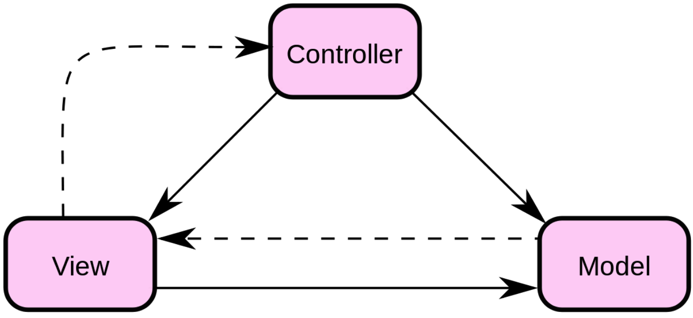
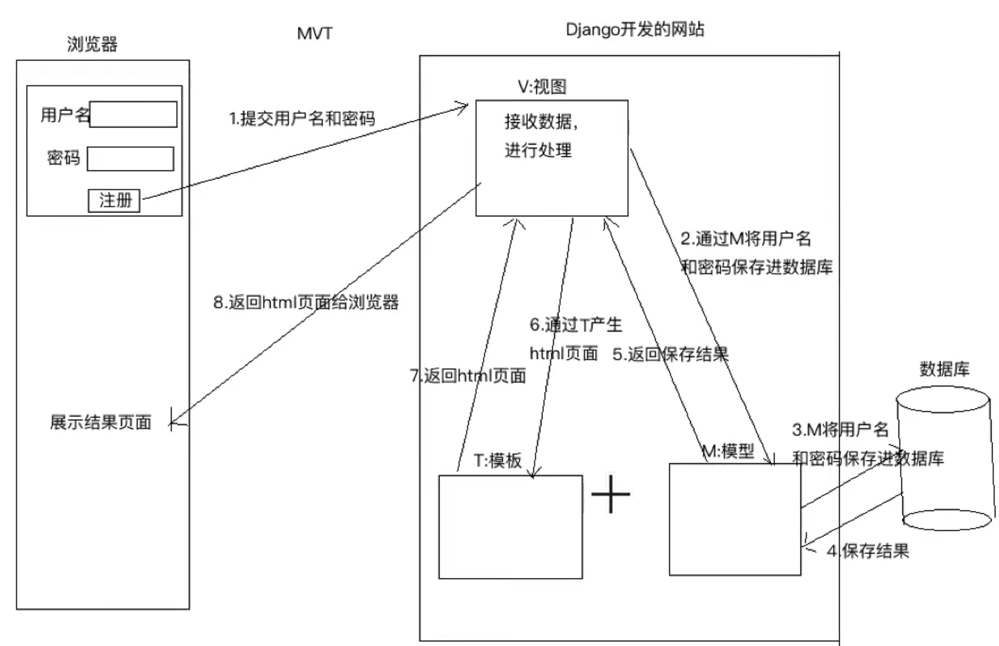

# 一、Django概述

具体参考：https://docs.djangoproject.com/zh-hans/4.0/


# 二、MVT 与 ORM

## MVC

解耦

- **Model（模型）** - 模型代表一个存取数据的对象或 JAVA POJO。它也可以带有逻辑，在数据变化时更新控制器。

- **View（视图）** - 视图代表模型包含的数据的可视化。

- **Controller（控制器）** - 控制器作用于模型和视图上。它控制数据流向模型对象，并在数据变化时更新视图。它使视图与模型分离开。

  

## MVVC

定义:Model（数据层）-View（视图层）-ViewModel（数据视图层），是一种双向数据绑定的响应式框架

目的:修改View，Model数据对应数据发生变化；Model数据发生变化，不需要修改DOM，直接更新DOM

## MVT

Model：与 MVC 中的 M 功能相同，负责和数据库交互，进行数据处理

View：与 MVC 中的 C 功能相同，接收请求，进行业务处理，返回应答

Template：与 MVC 中的 V 功能相同，负责封装构造要返回的 html




## ORM

ORM 框架可以将类和数据表进行对应起来，只要通过类和对象就可以对数据表进行操作

ORM 另外一个作用：根据设计的类生成数据库中的表。


# 三、安装及初步使用

## 1、 安装

## 2、创建项目以及应用

- 设置：注册应用、配置数据库、添加时区、添加模板目录
- 在 project/project/__init__.py 中添加 mysql 的代码、写 models 文件、执行迁移
- 配置路由、写views中函数
- 写html文件

```shell
# 创建一个项目
$ django-admin startproject sitename

# 创建应用
$ python3 manage.py startapp application_name
```


## 3、进入项目 shell

```shell
# 创建一个 shell
$ python3 manage.py shell
```


```python
from application_name.models import inside_class
# 增
instance = inside_class()
instance.attribute = xx		# 原来类中 attribute 是类属性，现在是实例属性

# 所有操作结束之后都要 save()
insatnce.save()

# 删
instance.delete()

# 改
instance = inside_class.objects.get(id=x)

# 查同上，get() 函数参数为条件

```

## 4、manager.py 命令

```shell
# 创建管理员
$ python3 manage.py createsuperuser

# 启动项目 [指定端口]
$ python3 manage.py runserver [127.0.0.1:8000]
```

## 5、文件夹结构

# 四、项目文件夹

## 1、__init__.py

配置数据库

```python
import pymysql
# 解决 django.core.exceptions.ImproperlyConfigured: mysqlclient 1.4.0 or newer is required; you have 0.9.3.
pymysql.version_info = (1, 4, 0, "final", 0)
pymysql.install_as_MySQLdb()
```

# 五、应用 app 文件夹

## 1、models.py：和数据库对应的类

 https://docs.djangoproject.com/zh-hans/4.0/#the-model-layer (注意版本)

### 模型类设计

ORM 框架可以将类和数据表进行对应起来，只需要通过类和对象就可以对数据表进行操作。

根据设计的类生成数据库中的表。

```python
# 必须继承 models.Model
class Mymodel(models.Model):
    ...
    def __str__(self):
        return self.attr
```

元选项

Django默认生成的表名：应用名小写_模型类名小写

需要在模型类中定义一个元类 Meta，在里面定义一个类属性 db_table 就可以指定表名

```python
class meta:
    db_table = 'dbname'		# 指定模型类对应的表名
```


### 字段属性和选项

```python
# 部分
#Models.Foreignkey 可以建立两个模型类之问一对多的关派，dianga 在生成表的时候，就会在多的表中创建一列作为外键，建立两个表之问一对多的关系。
# odels.CASCADE 级联删除，主键没有了该键也会被删除
attr = models.ForeignKey('object', on_delete=models.CASCADE)
```

### 生成与执行迁移文件

```shell
$ python3 manage.py makemigrations
$ python3 manage.py migrate
```

更改模型类需要再次迁移

### 模型类查询

```python
from diango,db.models import F,Q,Sum,Count,Avg,Max,Min
```


| 函数名   | 功能                                 | 返回值         | 说明                                                         |
| -------- | ------------------------------------ | -------------- | ------------------------------------------------------------ |
| get      | 返回表中满足条件的一条且只有一条数据 | 一个模型类对象 | 参数中写查询条件：<br /> 1、如果查到多条数据，则抛异常条MultipleobiectsReturned<br />2、查询不到数据，则拋异常DoesNotEx ist。 |
| all      | 返回模型类对应表格中的所有数据       | QuerySet  类型 | 查询集                                                       |
| filter   | 返回满足条件的数据                   | QuerySet  类型 | 参数写查询条件                                               |
| exclude  | 返回不满足条件的数据                 | QuerySet  类型 | 参数写查询条件                                               |
| order_by | 对查询集进行排序                     | QuerySet  类型 | 参数中写根据哪些字段进行排序                                 |

示例

```python
# get示例
BookInfo.objects.get(id=1)

# all示例
BookInfo.objects.all()

# filter示例
# 条件格式：模型类属性名__条件名=值 （双下划线）

# 判等 条件名：exact
BookInfo.objects.get(id__exact=1) #标准写法
BookInfo.objects.get(id=1) #简写

# 模糊查询 条件名：contains
BookInfo.objects.filter(btitle__contains='传') #带传字查询

# endswith结尾，starswitch开头
BookInfo.objects.filter(btitle__endswith='部')

# 空查询 isnull
BookInfo.objects.filter(btitle__isnull=False) #查询不为空的书名

# 范围查询 in
BookInfo.objects.filter(id__in=[1,2,3])		# select * from booktext_bookinfo where id in (1,2,3);

# 比较查询
# gt(greate than) lt(less than) gte(大于等于) lte(小于等于)

BookInfo.objects.filter(id__gt=3)	# = select * from booktest_bookinfo where id>3;

# 日期查询

BookInfo.objects.filter(bpub_date__year=1980) #1980年发表的书

from datetime import date
BookInfo.objects.filter(bpub_date__gt=date(1999,2,5)) #查询1999，2，5号后发表的书

# exclude方法示例：
BookInfo.objects.exclude(id=3)

# order_by方法示例：
BookInfo.objects.all().order_by('id') #从小到大
BookInfo.objects.order_by(‘id’)

BookInfo.objects.all().order_by('-id') #从大到小
BookInfo.objects.order_by('-id')

BookInfo.objects.filter(id__gt=3).order_by('bread') #从大到小
```

#### 查询集

all、filter、exclude、order_by 调用这些函数会产生一个查询集，QuerySet 类对象可以继续调用上面的所有函数。

查询集特性：

- 惰性查询：只有在实际使用查询集中的数据的时候才会发生对数据库的真正查询

- 缓存：当使用的是同一个查询集时，第一次的时候会发生实际数据库的查询，然后把结果缓存起来，之后再使用这个查询集时，使用的是缓存中的结果。

限制查询集：

- 可以对一个查询集进行取下标或者切片操作来限制查询集的结果。

- 对一个查询集进行切片操作会产生一个新的查询集，下标不允许为负数

  ```python
  b[0]	# 如果 b[0] 不存在，会报 IndexError 
  b[0:1].get		# 如果 b10:1].get()不存在，会抛出 DoesNotExist 异常
  ```

exists 判断一个查询集中是否有数据：True False

#### F 对象

作用：用于类属性之间的比较

```python
# 使用之前需要先导入
from django.db.models import F
BookInfo.objects.filter(bread__gt=F('bcomment'))	# 阅读量大于评论量
BookInfo.objects.filter(bread__gt=F('bcomment') * 2)	# 阅读量大于评论量
```

#### Q对象

作用：用于查询时条件之间的逻辑关系。not and or，可以对 Q 对象进行 &  |  ~

```python
BookInfo.objects.filter(id__gt=3, bread__gt=3)
BookInfo.objects.filter(Q(id__gt=3) & Q(bread__gt=3)) #与关系

BookInfo.objects.filter(Q(id__gt=3) | Q(bread__gt=3)) #或关系

BookInfo.objects.filter( ~Q(bread__gt=3)) #非关系
```

#### 聚合函数

作用：对查询结果进行聚合 sum count avg max min

- aggregate 调用这个函数来使用聚合。返回值是一个字典

  ```python
  # 使用前需先导入聚合类
  from django.db.models import Sum,Count,Max,Min,Avg
  
  BookInfo.objects.all().aggregate(Count('id'))	# 查询所有图书的数目
  BookInfo.objects.aggregate(Sum('bread'))	# 查询所有图书阅读量的总和
  ```

- count  统计满足条件数据的数目,返回值是一个数字

```python
BookInfo.objects.all().count()
BookInfo.objects.count()	# 统计所有图书的数目
BookInfo.objects.filter(id__gt=3).count()	# id大于3的所有图书的数目
```

### 关联对象

- 一对多关系

  ```python
  from django.db import models
  
  class Blog(models.Model):
      # ...
      pass
  
  class Entry(models.Model):
      blog = models.ForeignKey(Blog, on_delete=models.CASCADE, null=True)
  ```

- 多对多关系：定义在哪个类都可以

  ```python
  class Topping(models.Model):
      # ...
      pass
  
  class Pizza(models.Model):
      toppings = models.ManyToManyField(Topping)
  ```

- 一对一关系

  ```python
  models.OneToOneField()	# 定义在哪个类都可以
  ```

### 关联查询

在一对多关系中，一对应的类我们把它叫做一类，多对应的那个类我们把它叫做多类，我们把多类中定义的建立关联的类属性叫做关联属性

通过模型类实现关联查询时，要查哪个表中的数据，就需要通过哪个类来查

写关联查询条件的时候，如果类中没有关系属性，条件需要写对应类的名；如果类中有关系属性，直接写关系属性。

```python
# 通过多类的条件查询一类的数据：
# 一类名.objects.filter(多类名小写__多类属性名__条件名)
b = BookInfo.objects.get(id=1)
b.heroinfo_set.all()	# 查询id为1的图书关联的英雄的信息
HeroInfo.objects.filter(hbook__id=1)	# 通过模型类查询

# 通过一类的条件查询多类的数据：
# 多类名.objects.filter(关联属性__一类属性名__条件名)
h = HeroInfo.objects.get(id=1)
h.hbook		# 查询id为1的英雄关联的图书信息
BookInfo.objects.filter(heroinfo__id=1)		# 通过模型类查询

# 其他例子
BookInfo.objects.filter(heroinfo__hcomment__contains='八')	# 查询图书要求关联的英雄描述包含八
BookInfo.objects.filter(heroinfo__id__gt=3)		# 查询图书要求关联的英雄id大于3
HeroInfo.objects.filter(hbook__btitle='天龙八部')	# 查询天龙八部所有英雄信息
```

### 插入、更新和删除

调用一个模型类对象的save方法实现对模型类对应数据表的插入和更新

调用一个模型类对象的delete方法实现对模型类对应数据表的删除

### 自关联

自关联是一种特殊的一对多关系

```python
# 显示广州和它的上下级行政区
class AreaInfo(models.model):
    """ 地区模型类 """
    # 地区名称
    atitle = models.CharField(max_length=20)
    # 关系属性，代表当前地区的父级地区
    aParents = models.ForeignKey('self', null=True, blank=True)
```

### 自定义 manager

BookInfo.objects.all()->objects 是 Django 帮我自动生成的管理器对象，通过这个管理器可以实现对数据的查询。

objects 是 models.Manger 类的一个对象。自定义管理器之后 Django 不再帮我们生成默认的 objects 管理器。

```python
class BookInfoManager(models. Manager):
    """ 图书撲型爹理器类 """
    # 1.改变查询的结果集
	def all(self):
        # 1.调用父类的all，获取所有数据
        books = super().all()
        # 2.对数据进行过滤
        books = books.filter(isDelete=False)
		# 3.返回
        return books
    
    def create_book(self, btitle, bpub_date):
        # 获取self所在的模型类
        model_class = self.model
        book = model_class()
        # book = BookInfo)
        book.btitle = btitle
        book.bpub_date = bpub_date
        # 2.保存进数据库
        book.save()
        # 3.返回 book
        return book
```

再在具体的模型类里定义一个自定义管理器类的对象

```python
object = BookInfoManager()
```

自定义管理器类的应用场景

- 改变查询的结果集。
  比如调用 BookInfo.books.all() 返回的是没有删除的图书的数据。
- 添加额外的方法。
  管理器类中定义一个方法帮我们操作模型类对应的数据库。
  使用 self.model() 就可以创建一个跟自定义管理器对应的模型类对象

## 2、admin.py：后台管理

https://docs.djangoproject.com/zh-hans/4.0/#the-admin (注意版本)

在应用下的admin.py 中注册模型类，告诉 djang 框架根据注册的模型类来生成对应表管理页面

```python
class BookInfoAdmin(admin.ModelAdmin):
    """图书模型管理类"""
    list_display = ['id', 'btitle', 'bpub_date']


class HeroInfoAdmin(admin.ModelAdmin):
    """英雄人物模型管理类"""
    list_display = ['id', 'hname', 'bgender', 'hcomment']


# 注册模型类
admin.site.register(BookInfo, BookInfoAdmin)
admin.site.register(HeroInfo, HeroInfoAdmin)
```

申请超级管理员

```shell
$ python3 manage.py createsuperuser
```

配置结束后需要在项目文件夹下 urls.py 配置url路径

```python
urlpatterns = [
    re_path(r'^admin/', admin.site.urls),    # 配置项目  第一个参数为正则表达式
    re_path(r'^', include('bookapp.urls'))   # 包含 bookapp 应用中的 urls 文件
]
```

## 3、views.py

https://docs.djangoproject.com/zh-hans/4.0/#the-view-layer (注意版本)

视图函数必须有一个参数request，进行处理之后，需要返回一个HttpResponse 的类对象，hello world 就是返回给浏览器显示的内容。

```python
def index(request):
    # 进行处理，和 M 和 T 进行交互
    return HttpResponse('hello world')
```

建立 ur l和视图函数之间的对应关系

### 使用模板

加载模板文件：去模板目录下面获取 html 文件的内容，得到一个模板对象

定义模板上下文：向模板文件传递数据

模板渲染：得到一个标准的htm 内容

```python
def index(request):
	# 进行处理，和M和丁进行交互
    # 使用模板文件
    # 1.加载模板文件，模板对象
    temp = loader.get template('booktest/index.html')
    # 2.定义模板上下文：给模板文件传递数据
    context = RequestContext (request, (1))
    # 3.模板渲染：产生标准的html内容
    res_html = temp.render (context)
    # 4.返曰给浏览器
    return HttpResponse(res_html)
```

django 已经封装好了

```python
from django.shortcuts import render
def index(request):
    return render(request, 'booktest/index.html', {'content': 'hello world'})
```

可以在模板目录下建立相应的 app 应用的专属文件夹，直接使用 'app-name/index.html' 使用

### 错误视图

404：找不到页面，关闭调试模式之后，默认会显示一个标准的错误页面，如果要显示自定义的页面，则需要的 templates 目录下面自定义一个 404.html 文件

### 参数

url.py 将获取的参数传给函数

```python
def show_arg(request, arg):
    return HttpResponse(arg)
```


## 4、urls.py

https://docs.djangoproject.com/zh-hans/4.0/#the-view-layer (注意版本)

#### url 匹配过程

```python
# 所有的url配”项都定义在一个叫做 urlpatterns 的列表中
# 第一个参数是正则表达式，第二个参数是对应的处理动作，可以写一个视图函数的名字，对应的动作可以是一个视图函数的名字，也可以是包含个应用的 urls.py 文件
urlpatterns = [
    re_path(r'^admin/', admin.site.urls), 
    re_path(r'^a', include('bookapp.urls')),	# 包含 bookapp 应用中的 urls 文件
    re_path(r'^books/(\d+)$', views.detail)		# 将 \d+ 括起来后，django会自动将获取到的内容当做参数传递给后面的函数
]
```

当用户输入如 http://127.0.0.1:8000/aindex 时，去除域名和最前面的 /，剩下 aindex，拿 aindex 字符串到**项目的 urls 文件**中进行匹配，匹配成功之后，去除匹配的 a 字符，拿剩下的 index 字符继续到 **app 的 urls 文件**地进行正则匹配，匹配成功之后执行视图函数 index，index 视图函数返回内容给浏览器来显示。

### 捕获参数

进行url匹配时，把所需要的捕获的部分设置成一个正则表达式组，这样django框架就会自动把匹配成功后相应组的内容作为参数传递给视图函数

- 位置参数：参数名可以随意指定

  ```python
  urlpatterns = [
      re_path(r'^books(\d+)$', views.detail)	# 捕获 url 参数
  ]
  ```

- 关键字参数：在位置参数的基础上给正则表达式组命名即可

  函数返回给浏览器，组名和函数的变量要同名

  ```python
  urlpatterns = [
      re_path(r'^books(?P<arg>\d+)$', views.detail)
  ]
  
  views.py
  def show_arg(request, arg):
      return HttpResponse(arg)
  ```

  

## 5、tests.py

## 6、settings.py

https://docs.djangoproject.com/zh-hans/4.0/#forms (注意版本)

```python
# 注册应用，建立项目与应用之间的联系
INSTALLED_APPS = [
    ...,
    'application_name',   
]

# 语言和时区本地化
LANGUAGE_CODE = 'zh-hans'
TIME_ZONE = 'Asia/Shanghai'

# 配置模板文件
TEMPLATES = [
    {
        ...
        'DIRS': [os.path.join(BASE_DIR, 'templates')],  # 设置模板文件
        ...
    },
]
```

网站开发完成需要关闭调试模式

```python
DEBUG=False

ALLOWED_HOST=[' * ']
```


## 模板文件夹

### 模板文件的加载顺序

首先去配置的模板目录下面去找模板文件

去 INSTALLED_APPS 下面的每个应用的去找模板文件，前提是应用中必须有 templates 文件夹(网页报错中会显示)

### 模板变量

由数字、字母、下划线和点组成，不能以下划线开头

例如：{{ book.title }} 的解析顺序

1、首先把 book 当成是一个字典，把 title 当成一个键名进行取值：book['title']


https://docs.djangoproject.com/zh-hans/4.0/#the-template-layer (注意版本)

```html
/** for 循环 **/

	<li>{{ hero.hname }} -- {{ hero.hcomment }}</li>
// 如果遍历中内容为空，就执行 empty 中的内容

	<li>没有英雄信息</li>

```

# 五、功能设计

## 状态

### 使用 cookie


