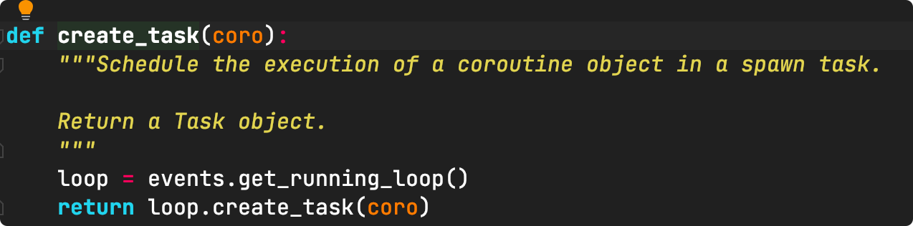

# 一、协程

**Coroutine** 也可以被称为微线程，即协同运行的例程，是一种用户态内的上下文切换技术。简而言之，其实就是通过一个线程实现代码块相互切换执行。

它是比是线程（thread）更细量级的用户态线程，特点是允许用户的主动调用和主动退出，挂起当前的例程然后返回值或去执行其他任务，接着返回原来停下的点继续执行。

实现协程可以通过：

> greenlet	早期模块
>
> gevent
>
> yield		  关键字
>
> asyncio	 装饰器 3.4
>
> asyncio、await 关键字 Python3.5

## 1、greenlet 实现协程

```python
from greenlet import greenlet
def func10():
    print(1)
    gr2.switch()
    print(2)
    gr2.switch()

def func20():
    print(3)
    gr1.switch()
    print(4)

gr1 = greenlet(func10)
gr2 = greenlet(func20)
gr1.switch() #第1步：去执行 func1 函数
```

> 官方手册：
>
> ​	english：https://greenlet.readthedocs.io/en/latest/ 
>
> ​	gevent：http://www.gevent.org/contents.html、https://www.osgeo.cn/gevent/intro.html
>

## 2、yield 实现协程

## 3、asyncio

遇到IO阻塞自动切换，**asyncio只能发tcp级别的请求，不能发http协议。**

```python
import asyncio

@asyncio.coroutine
def func1():
	print(1)
	# 网络I0请求：下载一张图片
	yield from asyncio.sleep(2） #遇到工0耗时操作，自动化切换到tasks中的其他任务
	print(2)
                             
@asyncio.coroutine
def func20:
print(3)
	# 网络Io请求：下载一张图片
	yield from asyncio.sleep(2） #遇到IO耗时操作，自动化切换到tasks中的其他任务
	print(4)

                             
tasks = [
    asyncio.ensure_future( func10 ),
    asyncio.ensure future( func20 )
]

              
loop = asyncio.get_event_loop()
loop.run_until_complete(asyncio.wait(tasks))
```

## 4、async & await 

python3.5之后

要实现异步处理，要有挂起的操作，当一个任务需要等待 IO 结果的时候，可以挂起当前任务，转而去执行其他任务，才能充分利用好资源。

要实现异步，使用 await 可以将耗时等待的操作挂起，让出控制权。当协程执行的时候遇到 await，时间循环就会将本协程挂起，转而去执行别的协程，直到其他的协程挂起或执行完毕。

```python
import asyncio

async def func1():
	print(1)
	# 网络Io请求：下载一张图片
	await asyncio.sleep(2)    # 遇到I0耗时操作，自动化切换到tasks中的其他任务
	print(2)
    
async def func2():
	print(3)
	# 网络Io请求：下载一张图片
	await asyncio.sleep(2)    # 遇到I0耗时操作，自动化切换到tasks中的其他任务
	print(4)

tasks = [
    asyncio.ensure_future( func1() ), # func1() 是协程
    asyncio.ensure_future( func2() )
]
loop = asyncio.get_event_loop()
loop.run_until_complete(asyncio.wait(tasks))
```

await fun1() 等待fun1()执行结束之后才会执行下面的代码

await 用来声明程序挂起，比如异步程序执行到某一步时需要等待的时间很长，就将此挂起，去执行其他的异步程序。await 后面只能跟异步程序或有__await__属性的对象，因为异步程序与一般程序不同。假设有两个异步函数async a，async b，a中的某一步有await，当程序碰到关键字await b()后，异步程序挂起后去执行另一个异步b程序，就是从函数内部跳出去执行其他函数，**当挂起条件消失后**，不管b是否执行完，要马上从b程序中跳出来，回到原程序执行原来的操作。如果await后面跟的b函数不是异步函数，那么操作就只能等b执行完再返回，无法在b执行的过程中返回。如果要在b执行完才返回，也就不需要用await关键字了，直接调用b函数就行。所以这就需要await后面跟的是异步函数了。在一个异步函数中，可以不止一次挂起，也就是可以用多个await。

> await挂起条件消失：

# 二、异步

异步是指在处理调用这个事务的之后，不会等待这个事务的处理结果，直接处理第二个事务去了，通过状态、通知、回调来通知调用者处理结果。

## 1、事件循环

```python 
# 伪代码
任务列表 = [任务1,任务2,任务3]
while True:
      可执行的任务列表，已完成的任务列表 = 去任务列表中检查所有的任务，将"可执行" 和 "已完成"的任务返回
      for 就绪任务  in 可执行的任务列表:
            执行已就堵旳任务

      for 已完成的任务 in 已完成任务列表:
            在任务列表中移除已完成任务

      如果任务列表中的任务都已完成，则终止循环

import asyncio
# 去生成或获取一个事件循环
1oop = asyncio.get_event_1oop0
# 将任务放到、任务列表
1oop.run_until_complete（任务）
```


## 2、使用

协程函数，定义函数时候 **async def** 函数名

协程对象，执行 **协程函数()** 得到的协程对象。 

注意：执行协程函数创建协程对象，函数内部代码不会执行。如果想要运行协程函数内部代码，必须要将协程对象交给事件循环来处理。

```python
async def func():
	pass
result = func()
```

```python
import asyncio

async def func(): 
	print("Hey,fuck you!")
    
result = func()

"""
    asyncio.run() 等价于
        loop = asyncio.get_event_loop()
        loop.run_until_complete( result )
"""
asyncio.run( result ) # python3.7
```


## 3、await

await + 可等待对象（协程对象、Future、Task对象 -> IO等待）

只能在协程（函数）中使用

```python
# 实例一
async def func1():
    print('come to play')
    response = await asyncio.sleep(2) # asyncio.sleep(2) 是一个 协程
    “”“
    
    ”“”
    print("结束", response)

asyncio.run( func1() )
```

```python
# 实例2
import asyncio

async def others():
    print('start')
    await asyncio.sleep(2)
    print('end')
    return 'value of return'

async def fun():
    print('执行协程函数内部的代码')

    # 遇到IO操作挂起当前协程(任务),等待IO操作完成之后再继续往下进行。当前协程挂起时，时间循环可以去执行其他协程(任务)
    response = await others()

    print("The request result of IO：",response)

asyncio.run( fun() )
```


### Task对象 

https://docs.python.org/3/library/asyncio-task.html#asyncio.create_task

> Tasks are used to schedule coroutines concurrently。
>
> When a coroutine is warpped into a **Task** with functions like **asyncio.create_tasks()** the coroutine is automatically scheduled to run soon。

 task，用于同步并发调度协程。它是对 coroutine 对象的进一步封装，它里面相比 coroutine 对象多了运行状态，比如 running、finished 等，可以用这些状态来获取协程对象的执行情况。

将 coroutine 对象传递给 run_until_complete() 方法的时候，实际上它进行了一个操作就是将 coroutine 封装成了 task 对象，也可以显式地进行声明

注意：asyncio.create_task() 函数在Python 3.7 中被加入，在Python 3.7之前，可以改用低层级的
asyncio.ensure_future() 函数。

```python
import asyncio
 
async def execute(x):
    print('Number:', x)
    return x
 
coroutine = execute(1)
print('Coroutine:', coroutine)
print('After calling execute')
 
loop = asyncio.get_event_loop()

task = loop.create_task(coroutine) 
# 创建task对象，将当前执行协程对象 coroutine 或者 execute() 添加到时间循环。

print('Task:', task)
loop.run_until_complete(task)
print('Task:', task)
print('After calling loop')

res:
Coroutine: <coroutine object execute at 0x10e0f7830>
After calling execute
Task: <Task pending coro=<execute() running at demo.py:4>>
Number: 1
Task: <Task finished coro=<execute() done, defined at demo.py:4> result=1>
After calling loop
```

　绑定回调：也可以为某个 task 绑定一个回调方法

```python
import asyncio
import requests
 
async def request():
    url = 'https://www.baidu.com'
    status = requests.get(url).status_code
    return status
 
def callback(task):
    print('Status:', task.result())
 
coroutine = request()
task = asyncio.ensure_future(coroutine)
task.add_done_callback(callback)
print('Task:', task)
 
loop = asyncio.get_event_loop()
loop.run_until_complete(task)
print('Task:', task)

Task: <Task pending coro=<request() running at demo.py:5> cb=[callback() at demo.py:11]>
Status: <Response [200]>
Task: <Task finished coro=<request() done, defined at demo.py:5> result=<Response [200]>>
```

上述代码也直接运行 

```python
print('Task Result:', task.result())
```

### 多任务协程 Task

可以定义一个 task 列表，然后使用 asyncio 的 wait() 方法即可执行

- asyncio.ensure_future() 

  ```python
  import asyncio
  import requests
  
  async def request():
      url = 'https://www.baidu.com'
      status =requests.get(url).status_code
      return status
  
  # 
  tasks = [asyncio.ensure_future(request()) for _ in range(5)]
  print('Tasks:',tasks)
  
  loop = asyncio.get_event_loop()
  loop.run_until_complete(asyncio.wait(tasks))
  
  for task in tasks:
      print('Task Result:',task.result())
  ```

  对于asyncio.wait，expect a list of futures（list of task） 

- asyncio.create_task( func() ) 

  ```python
  import asyncio
  
  async def func():
      print(1)
      await asyncio.sleep(2)
      print(2)
      return 'value'
  
  async def main():
      print('main start')
  
      task_list = [
          asyncio.create_task(func()),
          asyncio.create_task(func()) # 会立即将task对象加入到时间循环中 注意是asynio.create_task()
      ]
  
      print('main end')
  
      done, pending = await asyncio.wait(task_list, timeout=None)
      print(done)
  
  # 此处使用一个 main 函数的形式，是因为 create_task(func()) 会立即将 task 对象加入到时间循环中，而asyncio.run() 正好注册了一个 loop
  # asyncio.run() 里面只能加协程
  asyncio.run( main() )
  ```

  asyncio.create_task() 源码中是先获取loop，然后在调用loop.create_task()，要想不报错，直接使用loop.create_task()

  

- 自动创建task对象

  ```python
  import asyncio
  
  async def func():
      print(1)
      await asyncio.sleep(2)
      print(2)
      return 'value'
  
  task_list = [
      func(),
      func()
  ]
  
  done, pending = asyncio.run( asyncio.wait(task_list) )
  print(done)
  
  # 这样写会直接创建task对象  总时间 3s
  
  ```

  

### Future 对象

https://docs.python.org/3/library/asyncio-future.html

> A Future is special **low-level** awaitable object that represents an **eventual result** of an asynchronous operation.

代表将来执行或没有执行的任务的结果。

```python
import asyncio

async def set_after(fut):
    await asyncio.sleep(2)
    fut.set_result('666')

async def main():
    # 获取当前事件循环
    loop = asyncio.get_event_loop()

    # 创建一个任务(Future对象)，没有任何绑定行为，则这个任务永远不知道什么时候结束
    fut = loop.create_future()

    # 创建一个任务(Task对象)，绑定了set_after对象，函数内部在2s之后，会给fut赋值
    # 即手动设置future任务的最终结果，那么fut就可以结束
    await loop.create_task( set_after(fut) )

    # 等待Future对象获取 最终结果，否则一直等下去
    data = await fut
    print(data)

asyncio.run( main() )
```


```PYTHON 
def ensure_future(coro_or_future, *, loop=None):
    """Wrap a coroutine or an awaitable in a future.

    If the argument is a Future, it is returned directly.
    """
    if coroutines.iscoroutine(coro_or_future):
        if loop is None:
            loop = events.get_event_loop()
        task = loop.create_task(coro_or_future)
        if task._source_traceback:
            del task._source_traceback[-1]
        return task
    elif futures.isfuture(coro_or_future):
        if loop is not None and loop is not futures._get_loop(coro_or_future):
            raise ValueError('loop argument must agree with Future')
        return coro_or_future
    elif inspect.isawaitable(coro_or_future):
        return ensure_future(_wrap_awaitable(coro_or_future), loop=loop)
    else:
        raise TypeError('An asyncio.Future, a coroutine or an awaitable is '
                        'required')
```


>参考链接
>
>async 官方文档：https://docs.python.org/zh-cn/3/library/asyncio-task.html
>
>高性能异步爬虫：https://www.cnblogs.com/bobo-zhang/p/10735140.html
>
>

