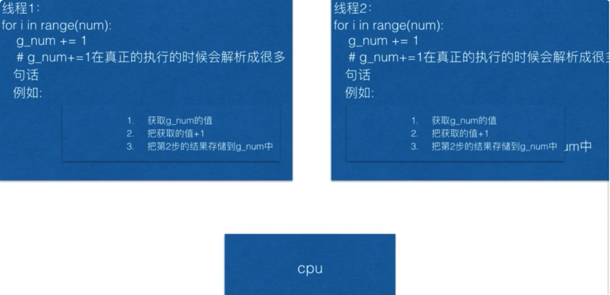

# 零、概念解释

并发（concurrency）和并行（parallellism）是：

1. 解释一：并行是指两个或者多个事件在同一时刻发生；而并发是指两个或多个事件在同一时间间隔发生。
2. 解释二：并行是在不同实体上的多个事件，并发是在同一实体上的多个事件。
3. 解释三：并行是在多台处理器上同时处理多个任务。如 hadoop 分布式集群，并发是在一台处理器上“同时”处理多个任务。

所以并发编程的目标是充分的利用处理器的每一个核，以达到最高的处理性能。

------

并行(parallel)：指在同一时刻，有多条指令在多个处理器上同时执行。所以无论从微观还是从宏观来看，二者都是一起执行的。

parallel.jpg

并发(concurrency)：指在同一时刻只能有一条指令执行，但多个进程指令被快速的轮换执行，使得在宏观上具有多个进程同时执行的效果，但在微观上并不是同时执行的，只是把时间分成若干段，使多个进程快速交替的执行。

concurrency.jpg

并行在多处理器系统中存在，而并发可以在单处理器和多处理器系统中都存在，并发能够在单处理器系统中存在是因为并发是并行的假象，并行要求程序能够同时执行多个操作，而并发只是要求程序假装同时执行多个操作（每个小时间片执行一个操作，多个操作快速切换执行）。

------

当有多个线程在操作时，如果系统只有一个 CPU，则它根本不可能真正同时进行一个以上的线程，它只能把 CPU 运行时间划分成若干个时间段，再将时间段分配给各个线程执行，在一个时间段的线程代码运行时,其它线程处于挂起状态.这种方式我们称之为并发（Concurrent）。

当系统有一个以上 CPU 时，则线程的操作有可能非并发。当一个 CPU 执行一个线程时，另一个 CPU 可以执行另一个线程，两个线程互不抢占 CPU 资源，可以同时进行，这种方式我们称之为并行（Parallel）。

# 多进程

## 进程池

初始化Poo时，可以指定一个最大进程数，当有新的请求提交到Pool中时，如果池还没有满，那么就会创建一个新的进程用来执行该请求。

但如果池中的进程数已经达到指定的最大值，那么该请求就会等待，直到池中有进程结束，才会用之前的进程来执行新的任务

# 资源竞争

### 原子性

对于一个多步骤程序，它要么完整的被执行，要么完全不执行。这种特性就叫原子性。

## 避免死锁

银行家算法

添加超时时间

# X 多任务中的一些问题

## 多线程

### 多线程与全局变量

