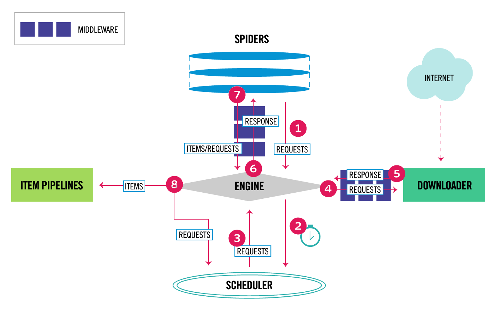
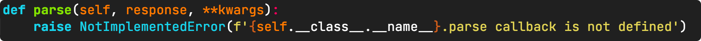
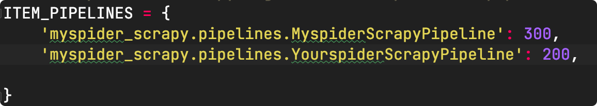
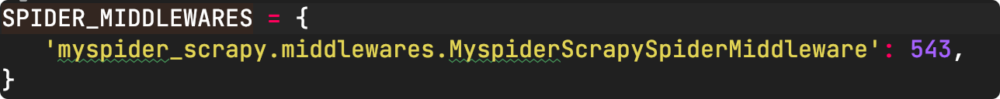
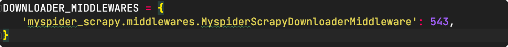

# 一、Scrapy

## Tutorial

英文具体参考：https://docs.scrapy.org/en/latest/index.html

中文具体参考：https://scrapy-chs.readthedocs.io/zh_CN/0.24/index.html

## Introduction

### 特点

- Scrapy 使用了 Twisted 异步网络框架，可以加快我们的下载速度。
- Scrapy 封装好了比如：发送网络请求、数据解析、数据存储、反反爬虫机制（更换ip代理、设置请求头等）、异步请求等。

### 架构图：



### 模块功能

1. Scrapy Engine： scrapy 框架的核心部分。负责在 Spider 和 ItemPipeline 、 Dounloader、Scheduler 中间通信、传递数据等。
2. spider：发送需要爬取的链接给引擎，最后引擎把其他模块请求回来的数据再发送给爬虫，爬虫就去解析想要的数据。**自己写的**
3. Schedule：接收引擎发送过来的请求，并按照一定的方式进行排列和整理，调度请求的顺序等。
4. Downloader：接收引擎传过来的下载请求，然后去网络上下载对应的数据再交还给引擎。
5. Item pipeline：将 spider 传递过来的数据进行保存。具体保存在哪里，应该看开发者自己的需求。**自己写的**
6. Downloader Middlewares：可以扩展下载器和引摯之间通信功能的中间件，
7. Spider Middlewares：可以扩展引擎和爬虫之间通信功能的中间件。

### 运行过程

- 引擎从Spider获取初始化的Requests对象
- 引擎把Requests对象调度至Scheduler,并且请求接下来的Requests
- Scheduler返回Requests到引擎
- 引擎通过下载中间件（Downloader Middlewares)把Requests发送给下载器（Downloader)
- 当请求完成后，下载器生成Response对象，通过下载中间件发送给引擎。
- 引擎接收到Respnse对象后，通过Spider中间件发送给Spider,用于后续处理。
- Spider处理Response对象，通过Spider中间，返回items和新的请求（如果有）给引擎。
- 引擎把处理好的items发送给Item Pipelines,处理过的新Requests给Scheduler。
- 流程不断重复，直到Scheduler中不再有新的Requests。


# 二、安装及初步使用

## 1. Installing and Creating a new spider

```shell
# 安装 Scrapy
$ pip3 install Scrapy

# 创建一个 scrapy 项目
$ django-admin startproject sitename

# 生成一个爬虫
$ scrapy genpider example example.com

# 生成一个 CrawlSpider
$ scrapy genspider -t crawl example example.com

# 启动一个爬虫
$ scrapy crawl example
```


# 三、各模块使用

## spider.py

### class Spider(scrapy.Spider)

```python
class Spider(scrapy.Spider):
    name = 'example'
    # 允许爬取的范围，防止爬虫爬到了别的网站
    allowed domains = ['example.com']
    # 开始爬取的地址
	start_urls = ['http://www.itcast.cn/channel/teacher.shtml']
    
    # 定义在 spider 下的 start_urls 默认交给 start_requests 处理,如果有必要，我们可以重写该方法
    def start_requests(self) :
        cookies = {}
        # scrapy.Request能构建一个requests,同时指定提取数据的callback函数
        yield scrapy.Request(
            self.start_urls[0],
            callback=self.parse,
            dont_filter=False
        )
    
    # 数据提取方法，接收下载中间件传过来的response
    def parse(self, response):
        # 返回包含选择器的列表
        names = response . xpath("...")
        print (names)      
```

scrapy.Request常用参数为:

- callback：指定传入的 url 交给哪个解析函数去处理
- meta：实现在不同的解析函数中传递数据，meta 默认会携带部分信息，比如下载延迟，请求深度等
- dont_filter: 让 scrapy 的去重不会过滤当前 url，scrapy 默认有 url 去重的功能,对需要重复请求的 url 有重要用途

必须实现 parse 方法

scrapy 会主动调用 parse 方法，不实现就会调用父类中的 parse 方法，父类中 parse 实现如下


### Spider(CrawlSpider)

```python
import scrapy
from scrapy.spiders import CrawlSpider, Rule
from scrapy.linkextractors import LinkExtractor

class MySpider(CrawlSpider):
    name = 'example'
    allowed_domains = ['example.com']
    start_urls = ['http://www.example.com']

    rules = (
        # Extract links matching 'category.php' (but not matching 'subsection.php')
        # and follow links from them (since no callback means follow=True by default).
        Rule(LinkExtractor(allow=('category\.php', ), deny=('subsection\.php', ))),

        # Extract links matching 'item.php' and parse them with the spider's method parse_item
        Rule(LinkExtractor(allow=('item\.php', )), callback='parse_item'),
    )

    def parse_item(self, response):
        url = ''
        item = scrapy.Item()	# 其实就是一个字典
        return response.follow(url, self.parse_page, meta=item)

    def parse_page(self, response, item):
        item= {}
        return item
```

指定start_ url，对应的响应会进过rules提取 url 地址

完善rules， 添加Rule：

```python
 rules = (
     Rule(LinkExtractor(allow=('category\.php', ), deny=('subsection\.php')), callback=self.parse_detail, follow=True)
 )
```

- LinkExtractor 参数使用
  - deny：满足括号中“正则表达式"的URL一定不提取（优先级高于allow)
  - allow_ domains：会被提取的链接的domains
  - deny_domains：一定不会被提取链接的domains
  - restrict_xpaths：使用xpath表达式，和allow共同作用过滤链接，即 xpath 满足范围内的url地址会被提取

- spiders.Rule 参数使用
  - link_extractor：是一个Link Extractor对象，用于定义需要提取的链接。
  - callback：连接提取器提取出来的ur地址对应的响应交给他处理，不指定callback函数的请求下，如果follow 为 True，满足该 rule 的 url 还会继续被请求
  - follow：是一个布尔(boolean)值，指定了根据该规则从response 提取的链接是否需要跟进。如果 callback 为 None，follow 默认设置为True，否则默认为False(可用来翻页)
  - process_links：指定该 spider 中哪个的函数将会被调用，从 link extractor 中获取到链接列表时将会调用该函数，该方法主要用来过滤 url
  - process_request：指定该 spider 中哪个的函数将会被调用，该规则提取到每个 request 时都会调用该函数，用来过滤 request

- 注意点：
  - 页面中 url 地址不完整，crawlspider会自动补充完整之后在请求
  - parse 函数不能定义，这个方法被CrawlSpider用来实现基础 url 提取等功能
  - 如果多个Rule都满足某一个url，会从 rules 中选择第一个满足的进行操作

### yield

使用 yield 

```python
...
def parse(self, response):
    for ...:
        item= {}
        yield item
```

Spider 必须返回 Request, BaseItem, dict or None

scrapy 框架会根据 yield 返回的实例类型来执行不同的操作，如果是 scrapy.Request 对象，scrapy框架会去获得该对象指向的链接并在请求完成后调用该对象的回调函数。

如果是 scrapy.Item 对象，scrapy 框架会将这个对象传递给 pipelines.py 做进一步处理。

## pipelines.py

### usage

在settings.py 中将 pipelines 开启，然后将spiders中的爬虫改为 yield item，数据就会经过 pipelines

```python
class MyspiderPipeline(object):
    # 调用此 classmethod 从爬虫程序创建管道实例。
    #它必须返回管道的新实例。Crawler 对象提供对设置和信号等所有核心组件的访问；这是管道访问它们并将其功能连接到Scrapy的一种方式。
    def from_crawler(cls, crawler):
        return cls(...)
        
    
    # 在爬虫开启的时候执行，仅执行一次
    def open_spider(self, spider):
        self.file = open(...)
        
	# 在爬虫关闭的时候执行，仅执行一次
    def close_spider(self, spider):
        self.file.close()
        
    # 实现存储方法
    def process_item(self, item, spider):
        # 不return的情况下，另个一个权重较低的pipeline就不会获取到该item
        retrun item
```

### in settings.py



pipeline 可以有多个

pipeline 的权重越小优先级越高

pipeline process_item 方法名不能修改为其他的名称


## items.py

```python
# scrapy.Item也是一个字典
class MyspiderItem(scrapy.Item):
    # define the fields for your item here like:
    # scrapy.Field() 是一个字典
    name = scrapy.Field()
    pass
```

- 在获取到数据的时候，使用不同的ltemn来存放不同的数据
- 在把数据交给pipeline的时候，可以通过isinstance(item,Myspiderltem)来判断数据是属于哪个item，进行不同的数据(item)处理

## settings.py

### Include

```python
# user agent
USER_AGENT = ''

# log level
# DEBUG WARNING INFO ...
LOG_LEVEL = ''

# 日志储存位置,位置基于项目根目录
LOG_FILE = ''

# pipelines
ITEM_PIPELINES= {
    'myspider_scrapy.pipelines.MyspiderScrapyPipeline': 300
}

# cookie debug
COOKIES_DEBUG = True

# 不遵守 robot 协议
ROBOTSTXT_OBEY = False
```


## middlewares.py

扩展下载器和引摯之间通信功能的中间件

### usage

在settings.py 中将 pipelines 开启，然后将spiders中的爬虫改为yield item，数据就会经过pipelines

```python
# Downloader Middlewares
class MyspiderScrapyDownloaderMiddleware:
    # 当每个 request 经过下载中间件时，该方法被调用
    def process_request(self, request, spider):
        ...
    
    # 当下载器完成 http 请求，传递响应给引擎的时候调用
    def process_response(self, request, response, spider):
        ...
```

加代理

```python
def process_request(self, request, spider):
    request.meta['proxy'] = 'http://127.0.0.1:7890'
    return None
```


还有 SPIDER_MIDDLEWARES：

English：https://docs.scrapy.org/en/latest/topics/spider-middleware.html

中文：https://scrapy-chs.readthedocs.io/zh_CN/1.0/topics/spider-middleware.html


spider 表示传进来的 request 对应的爬虫

### in settings.py






### 模拟登陆

**1、直接携带 cookie** 

- 应用场景
  - cookie过期时间很长，常见于些不规范的网站
  - 能在cookie过期之前把搜有的数据拿到
  - 配合其他程序使用，比如其使用selenium把登陆之后的cookie获取到保存到本地，scrapy 发送请求之前先读取本地cookie

在 settings 中添加该参数即可，cookie 能够在不同的解析函数中传递(前提也是 COOKIES_ENABLED 为True，cookie 在在 setting 中默认是开启的)，可以在终端中查看 cookie 的传递。

```python
# 不能把cookie放在headers中，无效
yield scrapy.Request(url,callback,cookies={})
```


**2、POST 请求携带**

FormRequest

```python
class ExampleSpider(scrapy.Spider):
    name = 'example'
    allowed_domains = ['github.com']
    start_urls = ['https://example.com/login']
    headers = ''

    def parse(self, response):
        # 查看请求中发送了什么内容,在此定义
        ...
        # 使用scrapy.Request的时候一直是发送的get请求，那么post请求就是需要使用sorapy.FormRequest来发送，同时使用 formdata 来携带需要post的数据
        return scrapy.FormRequest(
            "https://example.com/session",
            headers=self.headers,
            formdata=dict(
                ...
                login="user_name"
                password="password"
            ),
            # 登录之后的回调函数,不管请求成功没成功都会交给callback指定的函数处理
            callback=self.after_login
        )
    
    def after_login(self, response):
        ...
```


from_response

```python
class ExampleSpider(scrapy.Spider):
    name = 'example'
    allowed_domains = ["example.com"]
    start_urls = ["http://www.example.com/",]
    
    def parse(self,response):
        # from_response 从响应中找到 from 表单进行登录
        yield scrapy.FormRequest.from_response(
            # 自动从该响应中找到form表单进行登录
            response,
            formdata={"email": "username", "password": "password"},
            callback=self.parse_page
        )
    
    def parse_page(self,response):
        ...
```


# 四、scrapy shell

https://docs.scrapy.org/en/latest/topics/shell.html

```shell
$ scrapy shell http://www.exmple.com
```

shell 相当于调起 ipython

```python
response.url：当前响应的uri地址
response.request.url：当前响应对应的请求的url地址
response.headers：响应头
response.bodx：响应体，也就是html代码，默认是byte类型
response.requests.headers：当前响应的请求头
```

