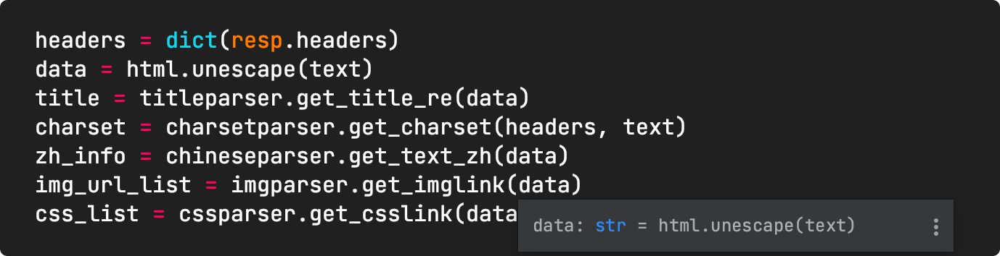

# 文档

readme采取小黄鸭学习法去记录笔记

.gitiignore

config

文件结构

做什么

怎么部署

怎么运行

介绍

requirements 注意版本 及系统

自动生成项目文档

https://www.jianshu.com/p/d4a1347f467b

打tag、readme文档强调输入与输出、添一句接口文档在哪、代码示例中不要抽象，直接整一个例子

import requests

res = requests.post(

  'http://192.168.33.63:8000/survivaldetection/_dns',

  json = {

​    "domains": [baidu.com]

  }

)

print(res.text)

# 程序开发

每个程序中用到的模块都应体现到 流程图中，

可能会更改的使用单独的模块

100% 不会更改的写在主模块中

在官方文档找不到方法时，可以看一下该项目的 issues github

项目中除了主文件(用到loggoing的文件)需要记录错误，其他地方如果使用try except直接把他们raise就好了